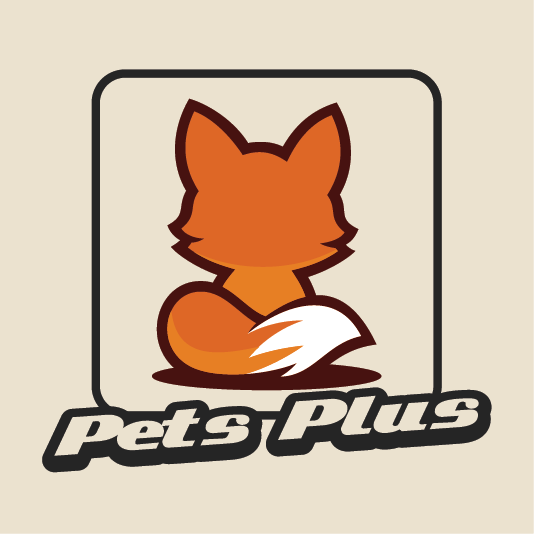

<p align="center">
  
</p>

<h1 align="center">woflo's Pets+</h1>
<h3 align="center">dev-0.96-Pet-this-Pet-that</h3>
<h4 align="center">next: goal improvements</h4>

---

<h4 align="center">Recent Changes</h3>
<ul align="center" style="list-style-type:none; padding-left:0; text-align:left; margin:0;">
  <li>Backend 0.94 [nature] - Parent natures are now exposed as predicates for natures.</li>
  <li>Updated 0.94 [version] - 1.21.8 -> 1.21.10. ;-;</li>
  <li>Rework 0.95 [ai] - Following the same path as the stimulus pipeline, AI uses pet context, mood engine snapshots, and more to allow dynamic emergent behaviour</li>
   <li>Added 0.96 [ai] - AIState exists</li>
</ul>

---

<p align="center">
  "I wish my block game contained a real-time emotion engine😔" - Someone, somewhere, at some point. probably.
  <br>
  <strong>Mod is NOT officially released.</strong>
</p>

---

### What you'll notice
- Realtime fluctuations in your pet's mood; shifting through the stimulus its exposed to throughout its environment and interactions.
- Natures act like baseline *personalities*, adding quirks to your pets moods and stats.
- Levels unlocks grow as you adventure, explore, and keep pets close.
- Roles allow your pet to fulfill... roles!
- Memories and stories are tracked.

Curious how each layer fits together? The [feature docs](docs/features/_readme.md) is your friend.

### Play It!
1. Download the latest jar file. 
2. Drop it into your `mods/` folder along with the Fabric API.
3. Launch and enjoy.

### Tweak It!
- All of the personalities, moods, roles, and triggers live in datapacks and configs, ready to remix.
- Ship tweaks with your pack or server so everyone shares the same vibe.

### Build It!
note: i prefer **idea suggestions** over *code contributions*. If your idea is well thought out, credit(s) will be attributed. rejection of ideas/code for any reason is fine; i'm picky. the better the documentation/reasoning, the higher liklihood of integration.

```bash
git clone https://github.com/woflo-dev/petsplus.git
cd petsplus
./gradlew build
```

#### Compatibility Notes
- Minecraft 1.21.10
- Fabric | Java 21
- Needs Fabric API

### Cred-It!
- Mod, systems, code: woflo
- Icon: GuriCreates — <https://guricreates.com>
- License: [GPL-3.0](LICENSE)

### Manual validation
- Spawned breeze and bogged mobs next to pets in a sandbox world and observed that only defensive/owner-guarding behaviors (owner orbit, lean against owner, patrol) retained the proximity multiplier while idle quirks and play actions remained unchanged.
- Placed trial spawner feature blocks near pets and confirmed that only wander/exploration goals (casual wander, purposeful patrol, trial scout) gained the exploration boost while social/idle goals stayed neutral.

Stay kind to your pets. They remember. Stay kind to me. I remember 🥺
