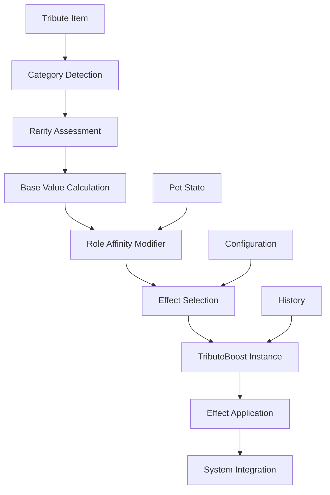

# Tribute Boost Effect System

## Overview

This document details the tribute boost effect system that defines how tribute offerings translate into permanent enhancements for pets. The system provides a framework for calculating, applying, and managing boost effects that integrate seamlessly with existing PetsPlus systems.

## Design Principles

1. **Permanent Enhancement** - Tribute effects persist until pet death
2. **Intuitive Impact** - Players should understand how tributes affect their pets
3. **Balanced Integration** - Effects work with existing systems without breaking balance
4. **Emergent Complexity** - Simple rules create complex, interesting outcomes
5. **Flexible Configuration** - Effects can be customized through JSON

## Effect Architecture



## Effect Types

### 1. Attribute Effects

#### Health Boost
- **Effect Type**: Permanent maximum health increase
- **Operation**: Additive value + multiplicative bonus
- **Integration**: Extends existing PetAttributeManager health modifiers
- **Calculation**: 
  ```
  Health Boost = Base Health × (0.02 × Rarity Tier × Category Multiplier)
  ```
- **Example**: Diamond tribute (Rare, Material) on Guardian
  - Base Health: 20
  - Rarity Multiplier: 2.0
  - Category Multiplier: 1.0
  - Role Affinity: 1.2
  - Result: +4.8 health (24% increase)

#### Defense Boost
- **Effect Type**: Damage reduction and armor enhancement
- **Operation**: Additive armor value + damage resistance
- **Integration**: Extends existing armor attribute system
- **Calculation**:
  ```
  Defense Boost = Base Defense × (0.015 × Rarity Tier × Category Multiplier)
  ```

#### Attack Boost
- **Effect Type**: Damage output increase
- **Operation**: Multiplicative damage modifier
- **Integration**: Extends existing attack damage attributes
- **Calculation**:
  ```
  Attack Boost = Base Attack × (0.025 × Rarity Tier × Category Multiplier)
  ```

#### Speed Boost
- **Effect Type**: Movement speed increase
- **Operation**: Multiplicative speed modifier
- **Integration**: Extends existing speed attributes
- **Calculation**:
  ```
  Speed Boost = Base Speed × (0.02 × Rarity Tier × Category Multiplier)
  ```

### 2. Mood Effects

#### Emotion Boost
- **Effect Type**: Permanent emotion baseline adjustment
- **Operation**: Additive emotion modifier
- **Integration**: Extends existing mood system
- **Effects by Category**:
  - **Food**: Joy, Contentment
  - **Material**: Confidence, Pride
  - **Magical**: Wonder, Excitement
  - **Special**: Affection, Loyalty

#### Mood Resilience
- **Effect Type**: Increased resistance to negative mood changes
- **Operation**: Decreased mood decay rate
- **Integration**: Extends existing mood decay mechanics
- **Calculation**:
  ```
  Mood Decay Rate = Base Rate ÷ (1 + (0.1 × Rarity Tier))
  ```

#### Emotional Capacity
- **Effect Type**: Increased maximum emotional intensity
- **Operation**: Higher emotion ceiling
- **Integration**: Extends existing emotion system
- **Effect**: Pet experiences emotions more intensely (both positive and negative)

### 3. Bond Effects

#### Bond Strength
- **Effect Type**: Increased bond value
- **Operation**: Additive bond increase
- **Integration**: Extends existing bond system
- **Calculation**:
  ```
  Bond Increase = 0.5 × Rarity Tier × Category Multiplier
  ```

#### Bond Resilience
- **Effect Type**: Slower bond decay
- **Operation**: Reduced bond loss rate
- **Integration**: Extends existing bond decay mechanics
- **Calculation**:
  ```
  Bond Decay Rate = Base Rate ÷ (1 + (0.15 × Rarity Tier))
  ```

#### Owner Affinity
- **Effect Type**: Enhanced owner-specific benefits
- **Operation**: Increased effectiveness when near owner
- **Integration**: Extends existing proximity systems
- **Effects**: Faster healing near owner, increased damage with owner

### 4. Ability Effects

#### Cooldown Reduction
- **Effect Type**: Faster ability recovery
- **Operation**: Multiplicative cooldown reduction
- **Integration**: Extends existing cooldown system
- **Calculation**:
  ```
  Cooldown Time = Base Cooldown × (1 - (0.05 × Rarity Tier))
  ```

#### Potency Increase
- **Effect Type**: Stronger ability effects
- **Operation**: Multiplicative effect modifier
- **Integration**: Extends existing ability system
- **Calculation**:
  ```
  Ability Potency = Base Potency × (1 + (0.08 × Rarity Tier))
  ```

#### Duration Extension
- **Effect Type**: Longer ability durations
- **Operation**: Additive duration increase
- **Integration**: Extends existing duration systems
- **Calculation**:
  ```
  Duration Increase = Base Duration × (0.1 × Rarity Tier)
  ```

### 5. Special Effects

#### Environmental Adaptation
- **Effect Type**: Improved performance in specific environments
- **Operation**: Context-dependent bonuses
- **Examples**:
  - Fire resistance for lava tributes
  - Water breathing for ocean tributes
  - Night vision for dark tributes

#### Combat Specialization
- **Effect Type**: Enhanced combat against specific enemy types
- **Operation**: Damage multipliers against enemy categories
- **Examples**:
  - Undead damage for holy tributes
  - Arthropod damage for special foods
  - Structure damage for material tributes

#### Sensory Enhancement
- **Effect Type**: Improved detection and awareness
- **Operation**: Increased detection radius and accuracy
- **Integration**: Extends existing AI behaviors
- **Effects**: Better target tracking, earlier threat detection

## Effect Calculation System

### Base Value Determination

#### Category Base Values
```json
{
  "material": {
    "health_base": 0.02,
    "defense_base": 0.015,
    "attack_base": 0.025,
    "speed_base": 0.02
  },
  "food": {
    "mood_base": 0.1,
    "bond_base": 0.5,
    "temporary_base": 0.3
  },
  "magical": {
    "ability_base": 0.08,
    "cooldown_base": 0.05,
    "special_base": 0.1
  },
  "special": {
    "unique_base": 0.15,
    "cross_mod_base": 0.1
  }
}
```

#### Rarity Multipliers
```json
{
  "common": 1.0,
  "uncommon": 1.0,
  "rare": 2.0,
  "epic": 3.0,
  "legendary": 5.0
}
```

### Final Effect Calculation

#### Step-by-Step Process
1. **Determine Base Value**: Use category-specific base values
2. **Apply Rarity Multiplier**: Scale by rarity tier
3. **Apply Category Modifiers**: Adjust for category effectiveness
4. **Apply Role Affinity**: Scale based on pet role preferences
5. **Apply Quality Modifiers**: Adjust for item condition, enchantments
6. **Apply Diminishing Returns**: Reduce for repeated tribute types
7. **Add Synergy Bonuses**: Enhance for complementary tribute patterns

#### Formula Template
```
Final Effect = Base Value × Rarity Multiplier × Category Modifier × 
              Role Affinity × Quality Modifier × (1 - Diminishing Returns) + 
              Synergy Bonus
```

## Effect Application System

### TributeBoost Class
```java
public class TributeBoost {
    private final Identifier itemId;
    private final String category;
    private final String rarity;
    private final Map<String, Float> effects;
    private final long timestamp;
    private final String flavorText;
    
    // Apply effects to pet component
    public void apply(PetComponent component, MobEntity pet);
    
    // Calculate effect values
    private Map<String, Float> calculateEffects(TributeData data, PetRoleType role);
    
    // Check for synergies with existing boosts
    private float calculateSynergyBonus(List<TributeBoost> existingBoosts);
}
```

### TributeRegistry Class
```java
public class TributeRegistry {
    // Store all active tribute boosts for a pet
    private final Map<UUID, List<TributeBoost>> petBoosts = new HashMap<>();
    
    // Apply new tribute boost
    public void applyTribute(MobEntity pet, ItemStack item);
    
    // Recalculate all effects
    public void refreshEffects(MobEntity pet);
    
    // Get tribute history
    public List<TributeBoost> getTributeHistory(UUID petId);
}
```

### EffectApplication Class
```java
public class EffectApplication {
    // Apply attribute boosts
    public static void applyAttributeBoosts(MobEntity pet, List<TributeBoost> boosts);
    
    // Apply mood effects
    public static void applyMoodEffects(PetComponent component, List<TributeBoost> boosts);
    
    // Apply bond effects
    public static void applyBondEffects(PetComponent component, List<TributeBoost> boosts);
    
    // Apply ability effects
    public static void applyAbilityEffects(PetComponent component, List<TributeBoost> boosts);
    
    // Apply special effects
    public static void applySpecialEffects(MobEntity pet, List<TributeBoost> boosts);
}
```

## Synergy and Combination System

### Tribute Synergy Types

#### Category Synergy
- **Material + Magical**: Enhanced durability
- **Food + Special**: Extended buff duration
- **Magical + Food**: Increased effect potency
- **Special + Material**: Unique combination abilities

#### Rarity Synergy
- **Multiple Common**: Slight boost to all common tributes
- **Mixed Rarities**: Higher rarity tributes boost lower ones
- **All Same Rarity**: Special bonus for dedication

#### Pattern Synergy
- **Sequential Tributes**: Same category in sequence = bonus
- **Alternating Tributes**: Different categories = balanced boost
- **Thematic Tributes**: Related items = special effect
- **Comprehensive Tributes**: All categories = mastery bonus

### Synergy Calculation
```java
public class SynergyCalculator {
    // Calculate synergy bonus for new tribute
    public static float calculateSynergyBonus(TributeBoost newBoost, List<TributeBoost> existingBoosts) {
        float synergyBonus = 0.0f;
        
        // Check category synergies
        synergyBonus += calculateCategorySynergy(newBoost, existingBoosts);
        
        // Check rarity synergies
        synergyBonus += calculateRaritySynergy(newBoost, existingBoosts);
        
        // Check pattern synergies
        synergyBonus += calculatePatternSynergy(newBoost, existingBoosts);
        
        return synergyBonus;
    }
}
```

## Diminishing Returns System

### Return Calculation
```java
public class DiminishingReturnsCalculator {
    // Calculate diminishing returns for repeated tribute types
    public static float calculateDiminishingReturns(String effectType, int tributeCount) {
        // First tribute: 100% effectiveness
        // Second tribute: 90% effectiveness
        // Third tribute: 70% effectiveness
        // Fourth+: 50% effectiveness
        switch (tributeCount) {
            case 1: return 1.0f;
            case 2: return 0.9f;
            case 3: return 0.7f;
            default: return 0.5f;
        }
    }
}
```

### Balance Rationale
- Encourages tribute variety
- Prevents exploitation of single powerful tribute
- Maintains long-term progression
- Rewards strategic thinking

## Configuration System

### Effect Configuration
```json
{
  "effect_definitions": {
    "health_boost": {
      "type": "attribute",
      "target": "health",
      "operation": "additive",
      "base_value": 0.02,
      "max_stacks": 10,
      "cap_multiplier": 2.0
    },
    "mood_boost": {
      "type": "mood",
      "target": "joy",
      "operation": "additive",
      "base_value": 0.1,
      "decay_resistance": 0.05
    },
    "cooldown_reduction": {
      "type": "ability",
      "target": "cooldown",
      "operation": "multiplicative",
      "base_value": 0.05,
      "max_reduction": 0.5
    }
  }
}
```

### Category Effect Mapping
```json
{
  "category_effects": {
    "material": {
      "primary_effects": ["health_boost", "defense_boost", "attack_boost"],
      "secondary_effects": ["mood_boost"],
      "effect_weights": {
        "health_boost": 0.4,
        "defense_boost": 0.3,
        "attack_boost": 0.2,
        "mood_boost": 0.1
      }
    },
    "food": {
      "primary_effects": ["mood_boost", "bond_strength"],
      "secondary_effects": ["health_boost"],
      "effect_weights": {
        "mood_boost": 0.5,
        "bond_strength": 0.4,
        "health_boost": 0.1
      }
    }
  }
}
```

## Integration with Existing Systems

### PetAttributeManager Integration
- Tribute boosts add to existing attribute modifiers
- Proper ordering of operations for balance
- Integration with existing attribute refresh system

### Mood System Integration
- Tribute effects influence emotion baselines
- Integration with existing mood decay mechanics
- Emotional responses to tribute offerings

### Ability System Integration
- Tribute boosts enhance ability performance
- Integration with existing cooldown system
- Effect potency modifications

### History System Integration
- Tribute history recorded in pet biography
- Integration with existing history mechanics
- Storytelling through tribute patterns

## Visual and Audio Feedback

### Effect Visualization
- Particle effects based on tribute category
- Color coding by rarity tier
- Duration indicators for temporary effects
- Visual representation of active boosts

### Audio Feedback
- Category-specific sound effects
- Rarity-tiered pitch variations
- Satisfaction sounds for successful tributes
- Special sounds for synergy effects

## Balance Considerations

### Power Scaling
- Tribute effects balanced against existing progression
- No single tribute provides game-breaking advantage
- Synergy bonuses encourage variety without overpowering
- Diminishing returns prevent exploitation

### Progression Integration
- Early tributes provide meaningful foundation
- Mid tributes enable specialization
- Late tributes provide unique advantages
- Tribute history creates pet biography

### Role Balance
- Each role benefits from different tribute types
- No single tribute category dominates all roles
- Role affinities create natural specialization
- Cross-category tributes provide balanced enhancement

## Conclusion

The tribute boost effect system provides a comprehensive framework for translating tribute offerings into meaningful permanent enhancements for pets. It integrates seamlessly with existing PetsPlus systems while providing intuitive, balanced progression that rewards player investment without creating artificial barriers.

The system's flexibility allows for extensive customization through configuration, while its emergent complexity creates opportunities for strategic thinking and personal expression. Players can develop their pets according to their preferred playstyle, creating unique companions through their tribute choices.