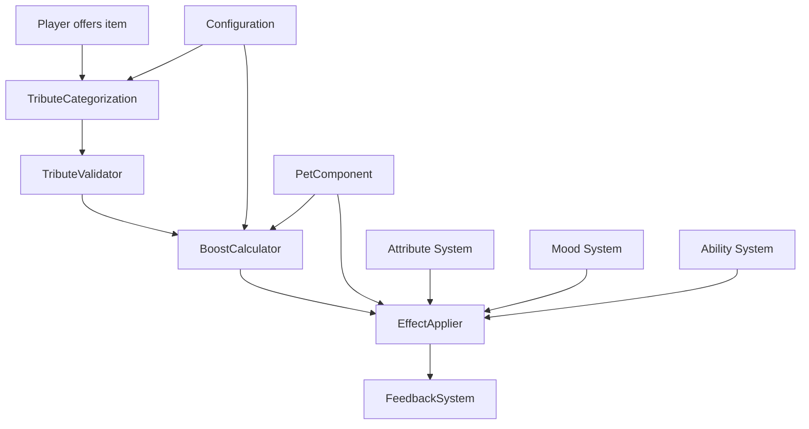

# Tribute Boost System Framework Design

## Overview

This document outlines a comprehensive redesign of the PetsPlus tribute system, transforming it from a gate-based progression blocker into a boost-based enhancement system that rewards investment without halting progress.

## Design Philosophy Alignment

### Core Principles Implemented

1. **Amplification Over Gates** - Progression enhances abilities rather than halting them
2. **Integration Without Separation** - Uses vanilla items/mechanics without disruption
3. **Emergent, Not Scripted** - Creates natural moments rather than scripted milestones
4. **Flexible Foundation** - Configurable through JSON
5. **Depth You Choose** - Functional at surface level but with optional complexity
6. **Moments Over Mechanics** - Creates opportunities, not scripts

## High-Level Architecture



## Core Components

### 1. Tribute Boost Framework

#### TributeBoostManager
Central coordinator for the tribute system:
- Processes tribute offerings
- Validates items
- Calculates boost effects
- Applies permanent modifiers
- Manages tribute history

#### TributeData
Immutable data structure representing a tribute:
- Item identifier
- Category (material, food, magical, special)
- Rarity tier (common, uncommon, rare, epic, legendary)
- Boost effects mapping
- Lore/flavor text

#### TributeEffect
Represents a specific boost effect:
- Type (attribute, mood, ability, bond)
- Target (specific stat or system)
- Value (magnitude of boost)
- Operation (additive, multiplicative)
- Duration (permanent until death)

### 2. Tribute Categorization and Rarity System

#### Categories
1. **Materials** - Ores, gems, resources
   - Examples: Iron ingot, diamond, netherite scrap
   - Primary effects: Attribute boosts (health, damage, defense)
   
2. **Food** - Edible items and treats
   - Examples: Cake, golden carrot, special treats
   - Primary effects: Mood boosts, bond enhancement, temporary buffs
   
3. **Magical** - Enchanted items, potions, mystical components
   - Examples: Enchanted books, potions, eyes of ender
   - Primary effects: Ability enhancements, special powers
   
4. **Special** - Unique or modded items
   - Examples: Mod-specific items, rare artifacts
   - Primary effects: Unique boosts, cross-mod integration

#### Rarity Tiers
- **Common** - Basic materials (iron, coal)
- **Uncommon** - Refined materials (gold, redstone)
- **Rare** - Precious materials (diamond, emerald)
- **Epic** - Advanced materials (netherite, enchanted items)
- **Legendary** - Unique artifacts (dragon egg, elytra)

### 3. Tribute Boost Effect System

#### Effect Types
1. **Attribute Boosts**
   - Health, speed, attack damage, defense
   - Integrated with existing PetAttributeManager
   - Permanent until pet death

2. **Mood Enhancements**
   - Boost to specific emotions (joy, courage, etc.)
   - Integrated with existing mood system
   - Affects behavior and AI

3. **Ability Augmentations**
   - Cooldown reduction
   - Effect potency increase
   - Duration extension
   - Integrated with existing ability system

4. **Bond Strengthening**
   - Increased bond resilience
   - Faster bond recovery
   - Enhanced owner-pet connection

#### Effect Calculation
```
Final Boost = Base Value × Rarity Multiplier × Category Modifier × Role Affinity
```

### 4. Tribute Offering and Acceptance Mechanics

#### Offering Process
1. Player sneaks + right-clicks pet with item
2. System validates item as acceptable tribute
3. Calculates boost effects based on item properties
4. Applies permanent modifiers to pet
5. Provides visual and audio feedback
6. Records tribute in pet history

#### Validation Rules
- Any item can be offered (no hard restrictions)
- System determines value based on item properties
- Modded items automatically categorized by type
- Rarity inferred from vanilla item values or mod metadata

### 5. Integration with Existing Systems

#### PetComponent Integration
- New tribute module for tracking active boosts
- Tribute history for emergent storytelling
- Integration with existing progression systems

#### Attribute System Integration
- Leverages existing PetAttributeManager
- Tribute boosts stack with other modifiers
- Proper ordering of operations for balance

#### Mood System Integration
- Tribute effects influence pet emotions
- Special food tributes create joy moments
- Magical tributes may cause wonder/excitement

#### Ability System Integration
- Tribute boosts enhance ability performance
- Cooldown reductions and potency increases
- Synergies with existing ability framework

### 6. Configuration System

#### JSON Structure
```json
{
  "tribute_categories": {
    "material": {
      "base_multiplier": 1.0,
      "primary_effects": ["attributes"],
      "rarity_multipliers": {
        "common": 0.5,
        "uncommon": 1.0,
        "rare": 2.0,
        "epic": 3.0,
        "legendary": 5.0
      }
    },
    "food": {
      "base_multiplier": 0.8,
      "primary_effects": ["mood", "bond"],
      "special_treats": {
        "minecraft:cake": {
          "effects": ["joy_boost", "bond_strength"],
          "value": 3.0
        }
      }
    }
  },
  "item_overrides": {
    "minecraft:diamond": {
      "category": "material",
      "rarity": "rare",
      "custom_effects": ["health_boost", "bond_strength"]
    }
  },
  "role_affinities": {
    "petsplus:guardian": {
      "preferred_categories": ["material"],
      "boost_multiplier": 1.2
    }
  }
}
```

### 7. Feedback and Visualization System

#### Visual Effects
- Particle effects based on tribute category
- Color-coded by rarity tier
- Subtle orbital effects for active boosts
- Enhanced completion effects

#### Audio Feedback
- Category-specific sound effects
- Rarity-tiered pitch variations
- Satisfaction sounds for successful tributes

#### UI Feedback
- Action bar notifications
- Tribute history in pet inspection
- Visual indicators of active boosts
- Comparison tooltips for potential tributes

### 8. Emergent Moments Design

#### Natural Opportunities
- Players discover optimal tribute items through experimentation
- Different pets respond differently to tribute types
- Role-based affinities create specialization opportunities
- Tribute combinations create unique effects

#### Storytelling Elements
- Tribute history creates pet biography
- Special tributes mark memorable moments
- Seasonal or event-based tribute variations
- Player preferences shape pet development

## Migration Path

### Phase 1: Framework Implementation
- Implement core tribute boost system
- Create configuration structure
- Develop basic categorization system

### Phase 2: Integration
- Connect with existing pet systems
- Implement feedback mechanisms
- Add tribute history tracking

### Phase 3: Migration
- Convert existing tribute milestones to boost opportunities
- Maintain backward compatibility during transition
- Remove old gate-based system

### Phase 4: Enhancement
- Add advanced features and combinations
- Implement mod integration hooks
- Refine balance and effects

## Balance Considerations

### Power Scaling
- Tribute boosts should feel meaningful but not game-breaking
- Higher rarity items provide proportionally better benefits
- Diminishing returns on repeated tribute types
- Role-based affinities encourage specialization

### Accessibility
- Common items still provide useful boosts
- No tribute is completely worthless
- Clear feedback helps players understand value
- Configuration allows for server-specific balance

## Technical Implementation Notes

### Performance
- Tribute effects calculated once on offering
- Permanent modifiers applied efficiently through existing systems
- Minimal impact on gameplay performance
- Caching for frequently accessed tribute data

### Mod Compatibility
- Automatic categorization of modded items
- Configuration overrides for special cases
- Event hooks for mod integration
- Fallback systems for unknown items

### Data Persistence
- Tribute effects stored in existing pet data structure
- Backward compatibility with existing save files
- Efficient serialization of tribute history
- Migration utilities for old tribute system

## Conclusion

This tribute boost system transforms the current gate-based progression into a flexible, rewarding enhancement system that aligns with the PetsPlus design philosophy. It creates opportunities for player expression, emergent storytelling, and deep pet customization while maintaining the intuitive, integration-focused approach that defines the mod.

The system provides depth without complexity, allowing casual players to enjoy simple tribute interactions while enabling dedicated players to optimize their pet development through strategic tribute choices.