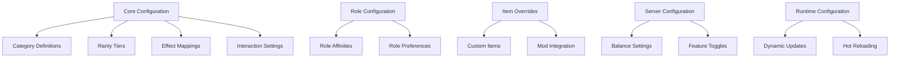

# Tribute Configuration System Design

## Overview

This document details the configuration system for the tribute boost framework. The system provides comprehensive customization options for server administrators while maintaining sensible defaults and automatic detection capabilities for most items.

## Configuration Architecture



## Core Configuration Structure

### Main Tribute Configuration File
**Location**: `config/petsplus/tribute_system.json`

```json
{
  "version": 1,
  "enabled": true,
  "debug_mode": false,
  "interaction_settings": {
    "primary_method": "sneak_right_click",
    "require_ownership": true,
    "require_sneaking": true,
    "allow_empty_hand": true,
    "interaction_range": 5.0,
    "cooldown_ticks": 20,
    "consume_items": true,
    "creative_mode_consumption": false
  },
  "tribute_settings": {
    "max_active_tributes": 10,
    "tribute_capacity_base": 5,
    "tribute_capacity_per_level": 0.2,
    "tribute_effectiveness_base": 1.0,
    "tribute_effectiveness_per_level": 0.01,
    "diminishing_returns_enabled": true,
    "synergy_enabled": true,
    "memory_enabled": true,
    "preferences_enabled": true
  },
  "feedback_settings": {
    "visual_feedback_enabled": true,
    "audio_feedback_enabled": true,
    "ui_feedback_enabled": true,
    "persistent_indicators": true,
    "particle_effects_enabled": true,
    "celebration_effects_enabled": true
  }
}
```

## Category Configuration

### Category Definitions
**Location**: `config/petsplus/tribute_categories.json`

```json
{
  "version": 1,
  "categories": {
    "material": {
      "enabled": true,
      "display_name": "Material",
      "description": "Raw and refined resources, building blocks, and crafting components",
      "base_multiplier": 1.0,
      "primary_effects": ["health_boost", "defense_boost", "attack_boost"],
      "secondary_effects": ["mood_boost"],
      "effect_weights": {
        "health_boost": 0.4,
        "defense_boost": 0.3,
        "attack_boost": 0.2,
        "mood_boost": 0.1
      },
      "auto_detect": {
        "enabled": true,
        "tags": ["minecraft:blocks", "minecraft:ores"],
        "name_patterns": ["ingot", "nugget", "gem", "ore", "block"],
        "properties": ["solid", "hard"],
        "excluded_items": ["minecraft:dirt", "minecraft:grass_block"]
      },
      "visual_settings": {
        "particle_color": "#808080",
        "particle_type": "minecraft:happy_villager",
        "sound_effect": "petsplus:tribute_material",
        "response_animations": ["head_tilt", "tail_wag"]
      }
    },
    "food": {
      "enabled": true,
      "display_name": "Food",
      "description": "Edible items and treats that pets would enjoy",
      "base_multiplier": 0.8,
      "primary_effects": ["mood_boost", "bond_strength"],
      "secondary_effects": ["health_boost"],
      "effect_weights": {
        "mood_boost": 0.5,
        "bond_strength": 0.4,
        "health_boost": 0.1
      },
      "auto_detect": {
        "enabled": true,
        "tags": ["minecraft:foods"],
        "properties": ["edible"],
        "components": ["food"],
        "excluded_items": ["minecraft:rotten_flesh", "minecraft:spider_eye"]
      },
      "special_treats": {
        "minecraft:cake": {
          "effects": ["joy_boost", "bond_strength"],
          "value_multiplier": 1.5,
          "flavor_text": "A special treat that brings pure joy",
          "response_type": "celebration",
          "particle_color": "#FFD700"
        },
        "minecraft:golden_carrot": {
          "effects": ["health_boost", "vision_boost"],
          "value_multiplier": 1.3,
          "flavor_text": "A nutritious treat with special properties",
          "response_type": "enthusiasm"
        }
      },
      "visual_settings": {
        "particle_color": "#90EE90",
        "particle_type": "minecraft:heart",
        "sound_effect": "petsplus:tribute_food",
        "response_animations": ["excited_jump", "lick"]
      }
    },
    "magical": {
      "enabled": true,
      "display_name": "Magical",
      "description": "Items with mystical properties, enchantments, or magical applications",
      "base_multiplier": 1.2,
      "primary_effects": ["ability_potency", "cooldown_reduction", "special_power"],
      "secondary_effects": ["mood_boost", "wisdom_boost"],
      "effect_weights": {
        "ability_potency": 0.4,
        "cooldown_reduction": 0.3,
        "special_power": 0.2,
        "mood_boost": 0.1
      },
      "auto_detect": {
        "enabled": true,
        "tags": ["minecraft:enchantable"],
        "properties": ["enchanted"],
        "name_patterns": ["enchanted", "potion", "brewing", "magical"],
        "enchantment_threshold": 1
      },
      "visual_settings": {
        "particle_color": "#9370DB",
        "particle_type": "minecraft:enchant",
        "sound_effect": "petsplus:tribute_magical",
        "response_animations": ["magical_glow", "mystic_dance"]
      }
    },
    "special": {
      "enabled": true,
      "display_name": "Special",
      "description": "Unique items, artifacts, and items with special properties",
      "base_multiplier": 1.5,
      "primary_effects": ["unique_power", "cross_mod_integration", "special_ability"],
      "secondary_effects": ["all_stats_small"],
      "effect_weights": {
        "unique_power": 0.5,
        "cross_mod_integration": 0.3,
        "special_ability": 0.2
      },
      "auto_detect": {
        "enabled": true,
        "fallback": true,
        "mod_namespaces": ["custom"],
        "special_items": ["minecraft:totem_of_undying", "minecraft:elytra"]
      },
      "visual_settings": {
        "particle_color": "#FFD700",
        "particle_type": "minecraft:end_rod",
        "sound_effect": "petsplus:tribute_special",
        "response_animations": ["special_pose", "unique_behavior"]
      }
    }
  }
}
```

## Rarity Configuration

### Rarity Tier Definitions
**Location**: `config/petsplus/tribute_rarity.json`

```json
{
  "version": 1,
  "rarity_tiers": {
    "common": {
      "display_name": "Common",
      "multiplier": 0.5,
      "particle_color": "#808080",
      "sound_pitch": 0.8,
      "max_tributes_per_tier": 10,
      "effect_cap": 2.0,
      "visual_effects": {
        "particle_count": 5,
        "particle_speed": 0.1,
        "animation_duration": 20
      }
    },
    "uncommon": {
      "display_name": "Uncommon",
      "multiplier": 1.0,
      "particle_color": "#00FF00",
      "sound_pitch": 1.0,
      "max_tributes_per_tier": 8,
      "effect_cap": 4.0,
      "visual_effects": {
        "particle_count": 8,
        "particle_speed": 0.15,
        "animation_duration": 30
      }
    },
    "rare": {
      "display_name": "Rare",
      "multiplier": 2.0,
      "particle_color": "#0080FF",
      "sound_pitch": 1.2,
      "max_tributes_per_tier": 6,
      "effect_cap": 8.0,
      "visual_effects": {
        "particle_count": 12,
        "particle_speed": 0.2,
        "animation_duration": 40,
        "special_effects": true
      }
    },
    "epic": {
      "display_name": "Epic",
      "multiplier": 3.0,
      "particle_color": "#8000FF",
      "sound_pitch": 1.4,
      "max_tributes_per_tier": 4,
      "effect_cap": 12.0,
      "visual_effects": {
        "particle_count": 16,
        "particle_speed": 0.25,
        "animation_duration": 50,
        "special_effects": true,
        "screen_effect": true
      }
    },
    "legendary": {
      "display_name": "Legendary",
      "multiplier": 5.0,
      "particle_color": "#FFD700",
      "sound_pitch": 1.6,
      "max_tributes_per_tier": 2,
      "effect_cap": 20.0,
      "visual_effects": {
        "particle_count": 25,
        "particle_speed": 0.3,
        "animation_duration": 60,
        "special_effects": true,
        "screen_effect": true,
        "world_effect": true
      }
    }
  },
  "auto_detection": {
    "enabled": true,
    "vanilla_mapping": {
      "minecraft:stone": "common",
      "minecraft:dirt": "common",
      "minecraft:wood_planks": "common",
      "minecraft:coal": "common",
      "minecraft:iron_ingot": "common",
      "minecraft:gold_ingot": "uncommon",
      "minecraft:redstone": "uncommon",
      "minecraft:lapis_lazuli": "uncommon",
      "minecraft:diamond": "rare",
      "minecraft:emerald": "rare",
      "minecraft:nether_quartz": "rare",
      "minecraft:netherite_scrap": "epic",
      "minecraft:ancient_debris": "epic",
      "minecraft:dragon_egg": "legendary",
      "minecraft:elytra": "legendary",
      "minecraft:totem_of_undying": "legendary",
      "minecraft:nether_star": "legendary",
      "minecraft:enchanted_golden_apple": "epic",
      "minecraft:golden_apple": "rare",
      "minecraft:cake": "uncommon",
      "minecraft:golden_carrot": "rare"
    },
    "modded_defaults": {
      "fallback_rarity": "uncommon",
      "material_rarity": "common",
      "food_rarity": "uncommon",
      "magical_rarity": "rare",
      "special_rarity": "epic"
    }
  }
}
```

## Effect Configuration

### Effect Definitions
**Location**: `config/petsplus/tribute_effects.json`

```json
{
  "version": 1,
  "effect_definitions": {
    "health_boost": {
      "type": "attribute",
      "target": "health",
      "operation": "additive",
      "base_value": 0.02,
      "max_stacks": 10,
      "cap_multiplier": 2.0,
      "duration": "permanent",
      "description": "Increases maximum health",
      "display_name": "Health Boost"
    },
    "defense_boost": {
      "type": "attribute",
      "target": "defense",
      "operation": "additive",
      "base_value": 0.015,
      "max_stacks": 10,
      "cap_multiplier": 1.5,
      "duration": "permanent",
      "description": "Increases defense and damage reduction",
      "display_name": "Defense Boost"
    },
    "attack_boost": {
      "type": "attribute",
      "target": "attack",
      "operation": "multiplicative",
      "base_value": 0.025,
      "max_stacks": 8,
      "cap_multiplier": 2.0,
      "duration": "permanent",
      "description": "Increases attack damage",
      "display_name": "Attack Boost"
    },
    "speed_boost": {
      "type": "attribute",
      "target": "speed",
      "operation": "multiplicative",
      "base_value": 0.02,
      "max_stacks": 6,
      "cap_multiplier": 1.5,
      "duration": "permanent",
      "description": "Increases movement speed",
      "display_name": "Speed Boost"
    },
    "mood_boost": {
      "type": "mood",
      "target": "joy",
      "operation": "additive",
      "base_value": 0.1,
      "max_stacks": 5,
      "cap_multiplier": 2.0,
      "duration": "permanent",
      "description": "Improves mood and emotional state",
      "display_name": "Mood Boost"
    },
    "bond_strength": {
      "type": "bond",
      "target": "strength",
      "operation": "additive",
      "base_value": 0.5,
      "max_stacks": 10,
      "cap_multiplier": 3.0,
      "duration": "permanent",
      "description": "Strengthens bond with owner",
      "display_name": "Bond Strength"
    },
    "ability_potency": {
      "type": "ability",
      "target": "potency",
      "operation": "multiplicative",
      "base_value": 0.08,
      "max_stacks": 5,
      "cap_multiplier": 2.0,
      "duration": "permanent",
      "description": "Increases ability effectiveness",
      "display_name": "Ability Potency"
    },
    "cooldown_reduction": {
      "type": "ability",
      "target": "cooldown",
      "operation": "multiplicative",
      "base_value": 0.05,
      "max_stacks": 8,
      "cap_multiplier": 1.0,
      "duration": "permanent",
      "description": "Reduces ability cooldowns",
      "display_name": "Cooldown Reduction"
    },
    "special_power": {
      "type": "special",
      "target": "unique",
      "operation": "custom",
      "base_value": 0.1,
      "max_stacks": 3,
      "cap_multiplier": 1.0,
      "duration": "permanent",
      "description": "Grants unique special abilities",
      "display_name": "Special Power"
    }
  },
  "synergy_effects": {
    "material_magical": {
      "required_categories": ["material", "magical"],
      "effect": "durability_boost",
      "value": 0.2,
      "description": "Enhanced durability from material and magical tributes"
    },
    "food_special": {
      "required_categories": ["food", "special"],
      "effect": "extended_buffs",
      "value": 0.3,
      "description": "Extended buff duration from food and special tributes"
    },
    "all_categories": {
      "required_categories": ["material", "food", "magical", "special"],
      "effect": "mastery_bonus",
      "value": 0.5,
      "description": "Mastery bonus for tributes from all categories"
    }
  }
}
```

## Item Override Configuration

### Custom Item Definitions
**Location**: `config/petsplus/tribute_item_overrides.json`

```json
{
  "version": 1,
  "item_overrides": {
    "minecraft:diamond": {
      "category": "material",
      "rarity": "rare",
      "custom_effects": ["health_boost", "bond_strength"],
      "value_multiplier": 1.2,
      "flavor_text": "A symbol of enduring strength and loyalty",
      "response_type": "enthusiasm",
      "special_interaction": true
    },
    "minecraft:cake": {
      "category": "food",
      "rarity": "uncommon",
      "custom_effects": ["joy_boost", "bond_strength"],
      "value_multiplier": 1.5,
      "flavor_text": "A special treat that brings pure joy",
      "response_type": "celebration",
      "consumption_behavior": "shared_eating"
    },
    "minecraft:totem_of_undying": {
      "category": "special",
      "rarity": "legendary",
      "custom_effects": ["survival_instinct", "death_ward"],
      "value_multiplier": 2.0,
      "flavor_text": "A powerful artifact that defies death itself",
      "response_type": "reverence",
      "special_interaction": true,
      "unique_ability": true
    },
    "minecraft:enchanted_book": {
      "category": "magical",
      "rarity": "variable",
      "rarity_determination": "enchantment_level",
      "custom_effects": ["knowledge_boost", "enchantment_affinity"],
      "value_multiplier": 1.0,
      "flavor_text": "Ancient knowledge bound in pages",
      "response_type": "curiosity",
      "enchantment_scaling": true
    }
  },
  "mod_integration": {
    "thermal": {
      "enabled": true,
      "category_mapping": {
        "thermal:obsidian_dust": "magical",
        "thermal:basalz_rod": "special"
      },
      "rarity_mapping": {
        "thermal:coins": "uncommon",
        "thermal:rich_slag": "rare"
      }
    },
    "botania": {
      "enabled": true,
      "category_mapping": {
        "botania:mana_pearl": "magical",
        "botania:petal": "special"
      },
      "rarity_mapping": {
        "botania:mana_tablet": "rare",
        "botania:teru_teru_bouzu": "epic"
      }
    }
  }
}
```

## Role Configuration

### Role-Specific Tribute Settings
**Location**: `config/petsplus/tribute_roles.json`

```json
{
  "version": 1,
  "role_affinities": {
    "petsplus:guardian": {
      "preferred_categories": ["material"],
      "category_multipliers": {
        "material": 1.2,
        "food": 0.8,
        "magical": 1.0,
        "special": 1.0
      },
      "preferred_effects": ["health", "defense", "attack"],
      "special_responses": {
        "material": "protective_stance",
        "rare_material": "fortification_behavior"
      }
    },
    "petsplus:support": {
      "preferred_categories": ["food", "magical"],
      "category_multipliers": {
        "material": 0.8,
        "food": 1.2,
        "magical": 1.2,
        "special": 1.0
      },
      "preferred_effects": ["bond", "mood", "ability_potency"],
      "special_responses": {
        "food": "nurturing_behavior",
        "magical": "healing_aura"
      }
    },
    "petsplus:scout": {
      "preferred_categories": ["magical", "special"],
      "category_multipliers": {
        "material": 0.8,
        "food": 1.0,
        "magical": 1.3,
        "special": 1.2
      },
      "preferred_effects": ["speed", "cooldown_reduction", "sensory_enhancement"],
      "special_responses": {
        "magical": "enhanced_senses",
        "special": "exploration_frenzy"
      }
    },
    "petsplus:striker": {
      "preferred_categories": ["material", "magical"],
      "category_multipliers": {
        "material": 1.1,
        "food": 0.9,
        "magical": 1.2,
        "special": 1.0
      },
      "preferred_effects": ["attack", "speed", "critical_chance"],
      "special_responses": {
        "material": "combat_stance",
        "magical": "elemental_fury"
      }
    }
  },
  "role_specific_effects": {
    "petsplus:guardian": {
      "material_tributes": {
        "defense_aura": true,
        "protective_instinct": true
      }
    },
    "petsplus:support": {
      "food_tributes": {
        "healing_enhancement": true,
        "buff_extension": true
      }
    }
  }
}
```

## Server Configuration

### Balance and Feature Toggles
**Location**: `config/petsplus/server_tribute_settings.json`

```json
{
  "version": 1,
  "balance_settings": {
    "global_multiplier": 1.0,
    "category_multipliers": {
      "material": 1.0,
      "food": 1.0,
      "magical": 1.0,
      "special": 1.0
    },
    "rarity_multipliers": {
      "common": 1.0,
      "uncommon": 1.0,
      "rare": 1.0,
      "epic": 1.0,
      "legendary": 1.0
    },
    "max_total_effects": 20,
    "diminishing_returns_threshold": 5,
    "synergy_bonus_cap": 2.0
  },
  "feature_toggles": {
    "tribute_system_enabled": true,
    "auto_categorization_enabled": true,
    "synergy_system_enabled": true,
    "memory_system_enabled": true,
    "preference_system_enabled": true,
    "ritual_system_enabled": true,
    "seasonal_variations_enabled": false,
    "mod_integration_enabled": true
  },
  "restrictions": {
    "max_tributes_per_day": 50,
    "max_tributes_per_hour": 10,
    "cooldown_between_tributes": 20,
    "restricted_items": [],
    "restricted_categories": [],
    "owner_only_mode": true
  },
  "advanced_settings": {
    "debug_mode": false,
    "verbose_logging": false,
    "performance_monitoring": false,
    "configuration_validation": true,
    "auto_backup": true,
    "hot_reload_enabled": true
  }
}
```

## Configuration Management System

### Configuration Loader
```java
public class TributeConfigurationLoader {
    private static TributeConfiguration instance;
    private static final Map<String, JsonObject> configCache = new HashMap<>();
    
    public static TributeConfiguration load() {
        if (instance == null) {
            instance = new TributeConfiguration();
            instance.loadAllConfigurations();
        }
        return instance;
    }
    
    private void loadAllConfigurations() {
        // Load core configuration
        loadConfiguration("tribute_system.json");
        
        // Load category configuration
        loadConfiguration("tribute_categories.json");
        
        // Load rarity configuration
        loadConfiguration("tribute_rarity.json");
        
        // Load effect configuration
        loadConfiguration("tribute_effects.json");
        
        // Load item overrides
        loadConfiguration("tribute_item_overrides.json");
        
        // Load role configuration
        loadConfiguration("tribute_roles.json");
        
        // Load server settings
        loadConfiguration("server_tribute_settings.json");
        
        // Validate configuration
        validateConfiguration();
    }
    
    private void loadConfiguration(String filename) {
        Path configPath = getConfigPath(filename);
        JsonObject config = loadJsonFile(configPath);
        configCache.put(filename, config);
    }
    
    public void reload() {
        configCache.clear();
        loadAllConfigurations();
    }
}
```

### Configuration Validator
```java
public class TributeConfigurationValidator {
    public static ValidationResult validate() {
        ValidationResult result = new ValidationResult();
        
        // Validate core configuration
        validateCoreConfiguration(result);
        
        // Validate category configuration
        validateCategoryConfiguration(result);
        
        // Validate rarity configuration
        validateRarityConfiguration(result);
        
        // Validate effect configuration
        validateEffectConfiguration(result);
        
        // Validate item overrides
        validateItemOverrides(result);
        
        // Validate role configuration
        validateRoleConfiguration(result);
        
        return result;
    }
    
    private static void validateCoreConfiguration(ValidationResult result) {
        JsonObject coreConfig = getConfig("tribute_system.json");
        
        // Check required fields
        if (!coreConfig.has("enabled")) {
            result.addError("Core configuration missing 'enabled' field");
        }
        
        if (!coreConfig.has("interaction_settings")) {
            result.addError("Core configuration missing 'interaction_settings' field");
        }
        
        // Validate interaction settings
        JsonObject interactionSettings = coreConfig.getAsJsonObject("interaction_settings");
        if (!interactionSettings.has("primary_method")) {
            result.addError("Interaction settings missing 'primary_method' field");
        }
    }
}
```

### Hot Reload System
```java
public class TributeConfigurationHotReload {
    private static final Map<String, Long> fileTimestamps = new HashMap<>();
    private static final ScheduledExecutorService scheduler = Executors.newScheduledThreadPool(1);
    
    public static void startMonitoring() {
        scheduler.scheduleAtFixedRate(TributeConfigurationHotReload::checkForChanges, 5, 5, TimeUnit.SECONDS);
    }
    
    private static void checkForChanges() {
        for (String filename : getConfigFiles()) {
            Path configPath = getConfigPath(filename);
            long currentTimestamp = getLastModifiedTimestamp(configPath);
            
            Long lastTimestamp = fileTimestamps.get(filename);
            if (lastTimestamp == null || currentTimestamp > lastTimestamp) {
                // File has changed, reload configuration
                reloadConfiguration(filename);
                fileTimestamps.put(filename, currentTimestamp);
            }
        }
    }
    
    private static void reloadConfiguration(String filename) {
        try {
            // Reload configuration
            TributeConfigurationLoader.getInstance().reload();
            
            // Notify systems of configuration change
            TributeConfigurationChangeEvent.fire(filename);
            
            Petsplus.LOGGER.info("Reloaded tribute configuration: {}", filename);
        } catch (Exception e) {
            Petsplus.LOGGER.error("Failed to reload tribute configuration: {}", filename, e);
        }
    }
}
```

## Configuration API

### Public Configuration Interface
```java
public class TributeConfigurationAPI {
    // Get category configuration
    public static CategoryConfig getCategoryConfig(String category) {
        return TributeConfigurationLoader.getInstance().getCategoryConfig(category);
    }
    
    // Get rarity configuration
    public static RarityConfig getRarityConfig(String rarity) {
        return TributeConfigurationLoader.getInstance().getRarityConfig(rarity);
    }
    
    // Get effect configuration
    public static EffectConfig getEffectConfig(String effect) {
        return TributeConfigurationLoader.getInstance().getEffectConfig(effect);
    }
    
    // Get item override
    public static ItemOverride getItemOverride(Identifier itemId) {
        return TributeConfigurationLoader.getInstance().getItemOverride(itemId);
    }
    
    // Get role affinity
    public static RoleAffinity getRoleAffinity(Identifier roleId) {
        return TributeConfigurationLoader.getInstance().getRoleAffinity(roleId);
    }
    
    // Check if feature is enabled
    public static boolean isFeatureEnabled(String feature) {
        return TributeConfigurationLoader.getInstance().isFeatureEnabled(feature);
    }
    
    // Get global multiplier
    public static float getGlobalMultiplier() {
        return TributeConfigurationLoader.getInstance().getGlobalMultiplier();
    }
    
    // Reload configuration
    public static void reload() {
        TributeConfigurationLoader.getInstance().reload();
    }
}
```

## Migration Configuration

### Legacy Tribute Migration
**Location**: `config/petsplus/tribute_migration.json`

```json
{
  "version": 1,
  "migration_settings": {
    "enabled": true,
    "auto_migrate": true,
    "backup_legacy_data": true,
    "preserve_history": true
  },
  "legacy_conversion": {
    "tribute_milestones": {
      "10": {
        "equivalent_tribute": {
          "item": "minecraft:gold_ingot",
          "category": "material",
          "rarity": "uncommon",
          "effects": ["health_boost", "defense_boost"]
        }
      },
      "20": {
        "equivalent_tribute": {
          "item": "minecraft:diamond",
          "category": "material",
          "rarity": "rare",
          "effects": ["health_boost", "attack_boost", "defense_boost"]
        }
      },
      "30": {
        "equivalent_tribute": {
          "item": "minecraft:netherite_scrap",
          "category": "material",
          "rarity": "epic",
          "effects": ["health_boost", "attack_boost", "defense_boost", "special_power"]
        }
      }
    }
  }
}
```

## Conclusion

The tribute configuration system provides comprehensive customization options for server administrators while maintaining sensible defaults and automatic detection capabilities. The modular configuration structure allows for fine-tuned control over all aspects of the tribute system, from basic interaction settings to advanced balance adjustments.

The configuration system is designed to be flexible and extensible, supporting both simple server setups and complex custom environments. Hot reload capabilities ensure that configuration changes can be applied without server restarts, while validation systems help prevent configuration errors.

The system also provides robust support for mod integration, allowing tribute effects to be customized for items from any mod while maintaining balance and consistency with the overall design philosophy.