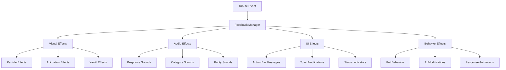

# Tribute Feedback and Visualization System

## Overview

This document details the feedback and visualization system for the tribute boost framework. The system provides comprehensive visual, audio, and UI feedback that makes tribute interactions intuitive, satisfying, and emotionally resonant while maintaining performance and accessibility.

## Feedback Architecture



## Visual Feedback System

### Particle Effects

#### Category-Specific Particles
```java
public class TributeParticleEffects {
    // Generate particles based on tribute category
    public static void generateCategoryParticles(ServerWorld world, MobEntity pet, String category, String rarity) {
        CategoryParticleConfig config = getCategoryParticleConfig(category);
        RarityParticleConfig rarityConfig = getRarityParticleConfig(rarity);
        
        // Merge configurations
        ParticleConfig mergedConfig = mergeParticleConfigs(config, rarityConfig);
        
        // Generate particles
        generateParticles(world, pet, mergedConfig);
    }
    
    private static void generateParticles(ServerWorld world, MobEntity pet, ParticleConfig config) {
        double x = pet.getX();
        double y = pet.getY() + pet.getHeight() * 0.7;
        double z = pet.getZ();
        
        // Create particle burst
        for (int i = 0; i < config.particleCount; i++) {
            double offsetX = (world.random.nextDouble() - 0.5) * config.spreadX;
            double offsetY = (world.random.nextDouble() - 0.5) * config.spreadY;
            double offsetZ = (world.random.nextDouble() - 0.5) * config.spreadZ;
            
            double velocityX = (world.random.nextDouble() - 0.5) * config.velocityX;
            double velocityY = world.random.nextDouble() * config.velocityY + 0.1;
            double velocityZ = (world.random.nextDouble() - 0.5) * config.velocityZ;
            
            world.spawnParticles(
                config.particleType,
                x + offsetX, y + offsetY, z + offsetZ,
                1, velocityX, velocityY, velocityZ, config.speed
            );
        }
    }
}
```

#### Particle Configuration
```java
public class CategoryParticleConfig {
    public static final Map<String, ParticleConfig> CATEGORY_PARTICLES = Map.of(
        "material", new ParticleConfig(
            ParticleTypes.HAPPY_VILLAGER,
            "#808080",
            10, 0.5, 0.8, 0.5,
            0.1, 0.15, 0.1,
            0.05
        ),
        "food", new ParticleConfig(
            ParticleTypes.HEART,
            "#90EE90",
            12, 0.6, 1.0, 0.6,
            0.08, 0.2, 0.08,
            0.03
        ),
        "magical", new ParticleConfig(
            ParticleTypes.ENCHANT,
            "#9370DB",
            15, 0.7, 1.2, 0.7,
            0.05, 0.25, 0.05,
            0.02
        ),
        "special", new ParticleConfig(
            ParticleTypes.END_ROD,
            "#FFD700",
            20, 0.8, 1.5, 0.8,
            0.02, 0.3, 0.02,
            0.01
        )
    );
}
```

#### Rarity Particle Enhancements
```java
public class RarityParticleEnhancements {
    public static void enhanceParticles(ParticleConfig baseConfig, String rarity) {
        switch (rarity) {
            case "uncommon":
                baseConfig.particleCount *= 1.2;
                baseConfig.speed *= 1.1;
                break;
            case "rare":
                baseConfig.particleCount *= 1.5;
                baseConfig.speed *= 1.2;
                addSecondaryParticles(baseConfig);
                break;
            case "epic":
                baseConfig.particleCount *= 2.0;
                baseConfig.speed *= 1.3;
                addSecondaryParticles(baseConfig);
                addTrailingParticles(baseConfig);
                break;
            case "legendary":
                baseConfig.particleCount *= 3.0;
                baseConfig.speed *= 1.5;
                addSecondaryParticles(baseConfig);
                addTrailingParticles(baseConfig);
                addExplosionParticles(baseConfig);
                break;
        }
    }
}
```

### Animation Effects

#### Pet Response Animations
```java
public class TributeResponseAnimations {
    // Play appropriate animation based on pet response
    public static void playResponseAnimation(MobEntity pet, PetResponse response) {
        switch (response.getType()) {
            case ENTHUSIASM:
                playEnthusiasmAnimation(pet);
                break;
            case AFFECTION:
                playAffectionAnimation(pet);
                break;
            case CELEBRATION:
                playCelebrationAnimation(pet);
                break;
            case CURIOSITY:
                playCuriosityAnimation(pet);
                break;
            case DISLIKE:
                playDislikeAnimation(pet);
                break;
            case FEAR:
                playFearAnimation(pet);
                break;
            default:
                playDefaultAnimation(pet);
        }
    }
    
    private static void playEnthusiasmAnimation(MobEntity pet) {
        // Jump animation
        pet.setVelocity(pet.getVelocity().add(0, 0.3, 0));
        
        // Tail wag animation
        if (pet instanceof WolfEntity) {
            // Wolf-specific tail wag
        } else if (pet instanceof CatEntity) {
            // Cat-specific tail animation
        }
        
        // Head tilt animation
        animateHeadTilt(pet, 30);
    }
    
    private static void playAffectionAnimation(MobEntity pet) {
        // Nuzzle animation
        animateNuzzle(pet);
        
        // Heart particles
        generateHeartParticles(pet);
        
        // Pur ring sound for cats
        if (pet instanceof CatEntity) {
            playPurrSound(pet);
        }
    }
    
    private static void playCelebrationAnimation(MobEntity pet) {
        // Spin animation
        animateSpin(pet, 360);
        
        // Jump animation
        pet.setVelocity(pet.getVelocity().add(0, 0.5, 0));
        
        // Special celebration particles
        generateCelebrationParticles(pet);
        
        // Special sound
        playCelebrationSound(pet);
    }
}
```

#### Custom Animation System
```java
public class PetAnimationSystem {
    private static final Map<UUID, AnimationContext> activeAnimations = new HashMap<>();
    
    // Start custom animation
    public static void startAnimation(MobEntity pet, String animationType, int duration) {
        AnimationContext context = new AnimationContext(animationType, duration, System.currentTimeMillis());
        activeAnimations.put(pet.getUuid(), context);
        
        // Apply initial animation state
        applyAnimationState(pet, context, 0.0f);
    }
    
    // Update active animations
    public static void updateAnimations(MobEntity pet) {
        AnimationContext context = activeAnimations.get(pet.getUuid());
        if (context != null) {
            long currentTime = System.currentTimeMillis();
            float progress = (float)(currentTime - context.startTime) / context.duration;
            
            if (progress >= 1.0f) {
                // Animation complete
                activeAnimations.remove(pet.getUuid());
                applyAnimationState(pet, context, 1.0f);
            } else {
                // Update animation progress
                applyAnimationState(pet, context, progress);
            }
        }
    }
    
    // Apply animation state based on progress
    private static void applyAnimationState(MobEntity pet, AnimationContext context, float progress) {
        switch (context.animationType) {
            case "head_tilt":
                animateHeadTilt(pet, (int)(30 * Math.sin(progress * Math.PI)));
                break;
            case "spin":
                animateSpin(pet, (int)(360 * progress));
                break;
            case "bounce":
                animateBounce(pet, (float)Math.sin(progress * Math.PI));
                break;
            case "nuzzle":
                animateNuzzle(pet, progress);
                break;
        }
    }
}
```

### Orbital Effects

#### Tribute Orbital Visualization
```java
public class TributeOrbitalEffects {
    // Create orbital effects for active tribute boosts
    public static void createOrbitalEffects(MobEntity pet, List<TributeEffect> activeEffects) {
        if (activeEffects.isEmpty()) return;
        
        // Group effects by category
        Map<String, List<TributeEffect>> effectsByCategory = groupEffectsByCategory(activeEffects);
        
        // Create orbital for each category
        for (Map.Entry<String, List<TributeEffect>> entry : effectsByCategory.entrySet()) {
            String category = entry.getKey();
            List<TributeEffect> effects = entry.getValue();
            
            createCategoryOrbital(pet, category, effects);
        }
    }
    
    private static void createCategoryOrbital(MobEntity pet, String category, List<TributeEffect> effects) {
        CategoryParticleConfig config = getCategoryParticleConfig(category);
        int particleCount = Math.min(effects.size() * 2, 20);
        
        // Calculate orbital parameters
        float radius = 1.5f + (effects.size() * 0.1f);
        float speed = 0.05f + (effects.size() * 0.005f);
        
        // Create orbital particles
        for (int i = 0; i < particleCount; i++) {
            float angle = (float)i / particleCount * 2.0f * (float)Math.PI;
            createOrbitalParticle(pet, config, radius, angle, speed);
        }
    }
    
    private static void createOrbitalParticle(MobEntity pet, CategoryParticleConfig config, float radius, float angle, float speed) {
        TributeOrbitalParticle particle = new TributeOrbitalParticle(
            pet,
            config.particleType,
            config.color,
            radius,
            angle,
            speed
        );
        
        // Register particle for ticking
        ParticleManager.registerParticle(particle);
    }
}
```

#### Dynamic Orbital System
```java
public class TributeOrbitalParticle {
    private final MobEntity pet;
    private final ParticleType particleType;
    private final String color;
    private final float radius;
    private float angle;
    private final float speed;
    private final float inclination;
    
    public TributeOrbitalParticle(MobEntity pet, ParticleType particleType, String color, float radius, float angle, float speed) {
        this.pet = pet;
        this.particleType = particleType;
        this.color = color;
        this.radius = radius;
        this.angle = angle;
        this.speed = speed;
        this.inclination = (float)Math.random() * 0.5f;
    }
    
    // Update particle position
    public void tick() {
        if (!pet.isAlive()) {
            // Particle cleanup
            ParticleManager.removeParticle(this);
            return;
        }
        
        // Update angle
        angle += speed;
        if (angle > 2.0f * Math.PI) {
            angle -= 2.0f * Math.PI;
        }
        
        // Calculate position
        double x = pet.getX() + radius * Math.cos(angle) * Math.cos(inclination);
        double y = pet.getY() + pet.getHeight() * 0.7 + radius * Math.sin(inclination);
        double z = pet.getZ() + radius * Math.sin(angle) * Math.cos(inclination);
        
        // Spawn particle at new position
        pet.getEntityWorld().spawnParticles(particleType, x, y, z, 1, 0, 0, 0, 0);
    }
}
```

## Audio Feedback System

### Category-Specific Sounds
```java
public class TributeAudioEffects {
    // Play sound based on tribute category
    public static void playCategorySound(ServerWorld world, MobEntity pet, String category, String rarity) {
        SoundEvent soundEvent = getCategorySoundEvent(category);
        float pitch = getRarityPitch(rarity);
        float volume = 1.0f;
        
        world.playSound(
            null,
            pet.getX(), pet.getY(), pet.getZ(),
            soundEvent,
            SoundCategory.NEUTRAL,
            volume,
            pitch
        );
    }
    
    private static SoundEvent getCategorySoundEvent(String category) {
        switch (category) {
            case "material":
                return SoundEvents.BLOCK_STONE_BREAK;
            case "food":
                return SoundEvents.ENTITY_GENERIC_EAT;
            case "magical":
                return SoundEvents.BLOCK_ENCHANTMENT_TABLE_USE;
            case "special":
                return SoundEvents.ENTITY_PLAYER_LEVELUP;
            default:
                return SoundEvents.ENTITY_ITEM_PICKUP;
        }
    }
    
    private static float getRarityPitch(String rarity) {
        switch (rarity) {
            case "common": return 0.8f;
            case "uncommon": return 1.0f;
            case "rare": return 1.2f;
            case "epic": return 1.4f;
            case "legendary": return 1.6f;
            default: return 1.0f;
        }
    }
}
```

### Response-Specific Sounds
```java
public class TributeResponseSounds {
    // Play sound based on pet response
    public static void playResponseSound(ServerWorld world, MobEntity pet, PetResponse response) {
        SoundEvent soundEvent = getResponseSoundEvent(response);
        float pitch = getResponsePitch(response);
        float volume = getResponseVolume(response);
        
        world.playSound(
            null,
            pet.getX(), pet.getY(), pet.getZ(),
            soundEvent,
            SoundCategory.NEUTRAL,
            volume,
            pitch
        );
    }
    
    private static SoundEvent getResponseSoundEvent(PetResponse response) {
        switch (response.getType()) {
            case ENTHUSIASM:
                return SoundEvents.ENTITY_WOLF_WHINE;
            case AFFECTION:
                return SoundEvents.ENTITY_CAT_PURR;
            case CELEBRATION:
                return SoundEvents.ENTITY_PLAYER_LEVELUP;
            case CURIOSITY:
                return SoundEvents.ENTITY_VILLAGER_YES;
            case DISLIKE:
                return SoundEvents.ENTITY_VILLAGER_NO;
            case FEAR:
                return SoundEvents.ENTITY_CREEPER_PRIMED;
            default:
                return SoundEvents.ENTITY_ITEM_PICKUP;
        }
    }
}
```

### Dynamic Audio System
```java
public class TributeAudioManager {
    private static final Map<String, SoundEvent> customSounds = new HashMap<>();
    
    // Register custom sounds
    public static void registerCustomSounds() {
        registerSound("tribute_material", SoundEvents.BLOCK_STONE_BREAK);
        registerSound("tribute_food", SoundEvents.ENTITY_GENERIC_EAT);
        registerSound("tribute_magical", SoundEvents.BLOCK_ENCHANTMENT_TABLE_USE);
        registerSound("tribute_special", SoundEvents.ENTITY_PLAYER_LEVELUP);
        registerSound("tribute_common", SoundEvents.ENTITY_ITEM_PICKUP);
        registerSound("tribute_uncommon", SoundEvents.ENTITY_EXPERIENCE_ORB_PICKUP);
        registerSound("tribute_rare", SoundEvents.ENTITY_VILLAGER_TRADE);
        registerSound("tribute_epic", SoundEvents.ENTITY_PLAYER_LEVELUP);
        registerSound("tribute_legendary", SoundEvents.ENTITY_WITHER_SPAWN);
    }
    
    // Play dynamic sound with variations
    public static void playDynamicSound(ServerWorld world, MobEntity pet, String soundId, float basePitch, float volume) {
        SoundEvent soundEvent = customSounds.get(soundId);
        if (soundEvent == null) return;
        
        // Add slight random variation to pitch
        float pitch = basePitch + (world.random.nextFloat() - 0.5f) * 0.1f;
        
        // Add slight random variation to volume
        float finalVolume = volume + (world.random.nextFloat() - 0.5f) * 0.1f;
        
        world.playSound(
            null,
            pet.getX(), pet.getY(), pet.getZ(),
            soundEvent,
            SoundCategory.NEUTRAL,
            finalVolume,
            pitch
        );
    }
}
```

## UI Feedback System

### Action Bar Messages
```java
public class TributeUIFeedback {
    // Display action bar message for tribute result
    public static void displayActionBarMessage(ServerPlayerEntity player, TributeData data, PetResponse response) {
        Text message = createActionBarMessage(data, response);
        player.sendMessage(message, true);
    }
    
    private static Text createActionBarMessage(TributeData data, PetResponse response) {
        String itemName = new ItemStack(data.getItemId()).getName().getString();
        String responseText = getResponseText(response);
        
        switch (response.getType()) {
            case ENTHUSIASM:
                return Text.literal("Pet enthusiastically accepts " + itemName + "!").formatted(Formatting.GREEN);
            case AFFECTION:
                return Text.literal("Pet affectionately nuzzles " + itemName + ".").formatted(Formatting.LIGHT_PURPLE);
            case CELEBRATION:
                return Text.literal("Pet celebrates " + itemName + " with joy!").formatted(Formatting.GOLD);
            case CURIOSITY:
                return Text.literal("Pet curiously examines " + itemName + ".").formatted(Formatting.YELLOW);
            case DISLIKE:
                return Text.literal("Pet reluctantly accepts " + itemName + ".").formatted(Formatting.GRAY);
            case FEAR:
                return Text.literal("Pet is afraid of " + itemName + ".").formatted(Formatting.RED);
            default:
                return Text.literal("Pet accepts " + itemName + ".").formatted(Formatting.WHITE);
        }
    }
}
```

### Toast Notifications
```java
public class TributeToastNotifications {
    // Display toast notification for significant tributes
    public static void displayToastNotification(ServerPlayerEntity player, TributeData data, PetResponse response) {
        if (response.getType() == PetResponse.Type.CELEBRATION || 
            data.getRarity().equals("legendary") || 
            data.getRarity().equals("epic")) {
            
            Toast toast = createTributeToast(data, response);
            player.getToastManager().add(toast);
        }
    }
    
    private static Toast createTributeToast(TributeData data, PetResponse response) {
        ItemStack itemStack = new ItemStack(data.getItemId());
        
        return SystemToast.create(
            player,
            SystemToast.Type.TUTORIAL_HINT,
            Text.literal("Tribute Accepted!"),
            Text.literal("Your pet loved the " + itemStack.getName().getString() + "!")
        );
    }
}
```

### Status Indicators
```java
public class TributeStatusIndicators {
    // Create status indicator for active tribute effects
    public static void createStatusIndicator(MobEntity pet, List<TributeEffect> activeEffects) {
        if (activeEffects.isEmpty()) return;
        
        // Create boss bar for significant tribute effects
        if (hasSignificantEffects(activeEffects)) {
            createTributeBossBar(pet, activeEffects);
        }
        
        // Create persistent particles for all effects
        createPersistentParticles(pet, activeEffects);
    }
    
    private static boolean hasSignificantEffects(List<TributeEffect> activeEffects) {
        return activeEffects.stream()
            .anyMatch(effect -> effect.getData().getRarity().equals("epic") || 
                             effect.getData().getRarity().equals("legendary"));
    }
    
    private static void createTributeBossBar(MobEntity pet, List<TributeEffect> activeEffects) {
        ServerBossBar bossBar = new ServerBossBar(
            Text.literal("Tribute Effects Active"),
            BossBar.Color.GREEN,
            BossBar.Style.PROGRESS
        );
        
        bossBar.setPercent(1.0f);
        bossBar.addPlayer(pet.getOwner());
        
        // Register boss bar for cleanup
        TributeBossBarManager.registerBossBar(pet.getUuid(), bossBar);
    }
}
```

## Pet Behavior Feedback

### Response Behaviors
```java
public class TributeBehaviorFeedback {
    // Trigger appropriate pet behavior based on tribute response
    public static void triggerResponseBehavior(MobEntity pet, PetResponse response) {
        switch (response.getType()) {
            case ENTHUSIASM:
                triggerEnthusiasmBehavior(pet);
                break;
            case AFFECTION:
                triggerAffectionBehavior(pet);
                break;
            case CELEBRATION:
                triggerCelebrationBehavior(pet);
                break;
            case CURIOSITY:
                triggerCuriosityBehavior(pet);
                break;
            case DISLIKE:
                triggerDislikeBehavior(pet);
                break;
            case FEAR:
                triggerFearBehavior(pet);
                break;
        }
    }
    
    private static void triggerEnthusiasmBehavior(MobEntity pet) {
        // Follow owner more closely
        PetComponent component = PetComponent.get(pet);
        if (component != null) {
            component.setFollowDistance(component.getFollowDistance() * 1.5f);
            component.setFollowDistanceTimer(200); // 10 seconds
        }
        
        // Play with nearby items
        playWithNearbyItems(pet);
        
        // Increased activity
        increaseActivityLevel(pet, 200);
    }
    
    private static void triggerAffectionBehavior(MobEntity pet) {
        // Nuzzle owner
        nuzzleOwner(pet);
        
        // Protective behavior
        enableProtectiveBehavior(pet, 300);
        
        // Bond boost
        PetComponent component = PetComponent.get(pet);
        if (component != null) {
            component.addBondStrength(1.0f);
        }
    }
    
    private static void triggerCelebrationBehavior(MobEntity pet) {
        // Special celebration animation
        playCelebrationAnimation(pet);
        
        // Summon nearby pets
        summonNearbyPets(pet);
        
        // Special ability use
        triggerSpecialAbility(pet);
    }
}
```

### Dynamic AI Modifications
```java
public class TributeAIModifications {
    // Apply AI modifications based on tribute effects
    public static void applyAIModifications(MobEntity pet, List<TributeEffect> activeEffects) {
        PetComponent component = PetComponent.get(pet);
        if (component == null) return;
        
        // Apply speed modifications
        float speedBoost = calculateSpeedBoost(activeEffects);
        if (speedBoost > 0) {
            modifyMovementSpeed(pet, speedBoost);
        }
        
        // Apply detection modifications
        float detectionBoost = calculateDetectionBoost(activeEffects);
        if (detectionBoost > 0) {
            modifyDetectionRange(pet, detectionBoost);
        }
        
        // Apply combat modifications
        float combatBoost = calculateCombatBoost(activeEffects);
        if (combatBoost > 0) {
            modifyCombatBehavior(pet, combatBoost);
        }
    }
    
    private static void modifyMovementSpeed(MobEntity pet, float speedBoost) {
        // Apply speed boost to pet movement
        pet.getAttributeInstance(EntityAttributes.GENERIC_MOVEMENT_SPEED)
            .addPersistentModifier(new EntityAttributeModifier(
                "tribute_speed_boost",
                speedBoost,
                EntityAttributeModifier.Operation.MULTIPLY_BASE
            ));
    }
    
    private static void modifyDetectionRange(MobEntity pet, float detectionBoost) {
        // Apply detection range boost
        if (pet instanceof MobEntitywithAi) {
            MobEntitywithAi mobWithAi = (MobEntitywithAi) pet;
            mobWithAi.setTargetingRange(mobWithAi.getTargetingRange() * (1.0f + detectionBoost));
        }
    }
}
```

## Performance Optimization

### Particle Management
```java
public class TributeParticleManager {
    private static final int MAX_PARTICLES_PER_FRAME = 100;
    private static final Queue<ParticleRequest> particleQueue = new ArrayDeque<>();
    
    // Queue particle request for optimized rendering
    public static void queueParticle(ServerWorld world, ParticleType type, double x, double y, double z, int count, double deltaX, double deltaY, double deltaZ, double speed) {
        if (particleQueue.size() < MAX_PARTICLES_PER_FRAME) {
            particleQueue.add(new ParticleRequest(world, type, x, y, z, count, deltaX, deltaY, deltaZ, speed));
        }
    }
    
    // Process queued particles
    public static void processQueuedParticles() {
        int processedCount = 0;
        while (!particleQueue.isEmpty() && processedCount < MAX_PARTICLES_PER_FRAME) {
            ParticleRequest request = particleQueue.poll();
            request.world.spawnParticles(
                request.type,
                request.x, request.y, request.z,
                request.count, request.deltaX, request.deltaY, request.deltaZ, request.speed
            );
            processedCount++;
        }
    }
}
```

### Audio Optimization
```java
public class TributeAudioOptimizer {
    private static final Map<UUID, Long> lastSoundTime = new HashMap<>();
    private static final long SOUND_COOLDOWN = 200; // 200ms cooldown
    
    // Play sound with cooldown to prevent audio spam
    public static void playSoundWithCooldown(ServerWorld world, MobEntity pet, SoundEvent sound, float volume, float pitch) {
        UUID petId = pet.getUuid();
        long currentTime = System.currentTimeMillis();
        
        Long lastTime = lastSoundTime.get(petId);
        if (lastTime == null || currentTime - lastTime > SOUND_COOLDOWN) {
            world.playSound(null, pet.getX(), pet.getY(), pet.getZ(), sound, SoundCategory.NEUTRAL, volume, pitch);
            lastSoundTime.put(petId, currentTime);
        }
    }
}
```

## Accessibility Features

### Visual Accessibility
```java
public class TributeAccessibilityFeatures {
    // Enhanced visual feedback for players with visual impairments
    public static void enhanceVisualFeedback(ServerPlayerEntity player, MobEntity pet, TributeData data, PetResponse response) {
        // Check if player has visual accessibility settings enabled
        if (hasVisualAccessibilityEnabled(player)) {
            // Enhanced particle effects
            generateEnhancedParticles(pet, response);
            
            // Brighter colors
            generateBrightParticles(pet, response);
            
            // Larger visual indicators
            generateLargeIndicators(pet, response);
        }
    }
}
```

### Audio Accessibility
```java
public class TributeAudioAccessibility {
    // Enhanced audio feedback for players with hearing impairments
    public static void enhanceAudioFeedback(ServerPlayerEntity player, MobEntity pet, TributeData data, PetResponse response) {
        // Check if player has audio accessibility settings enabled
        if (hasAudioAccessibilityEnabled(player)) {
            // Louder sounds
            playLouderSounds(pet, response);
            
            // Different frequency sounds
            playDifferentFrequencySounds(pet, response);
            
            // Visual indicators for audio events
            generateAudioVisualIndicators(pet, response);
        }
    }
}
```

## Configuration Integration

### Feedback Configuration
```json
{
  "feedback_settings": {
    "visual_feedback": {
      "enabled": true,
      "particle_effects": true,
      "animation_effects": true,
      "orbital_effects": true,
      "max_particles_per_frame": 100,
      "particle_quality": "high"
    },
    "audio_feedback": {
      "enabled": true,
      "category_sounds": true,
      "response_sounds": true,
      "max_volume": 1.0,
      "sound_cooldown": 200
    },
    "ui_feedback": {
      "enabled": true,
      "action_bar_messages": true,
      "toast_notifications": true,
      "status_indicators": true,
      "boss_bar_effects": true
    },
    "behavior_feedback": {
      "enabled": true,
      "response_behaviors": true,
      "ai_modifications": true,
      "follow_distance_boost": true,
      "activity_level_boost": true
    },
    "accessibility": {
      "visual_enhancements": false,
      "audio_enhancements": false,
      "high_contrast_particles": false,
      "louder_sounds": false
    }
  }
}
```

## Conclusion

The tribute feedback and visualization system provides comprehensive, intuitive feedback that makes tribute interactions satisfying and emotionally resonant. The system uses a multi-layered approach with visual, audio, UI, and behavioral feedback to create a rich, immersive experience.

The system is designed with performance and accessibility in mind, ensuring that it runs smoothly on a wide range of systems while providing options for players with different accessibility needs. The modular configuration system allows server administrators to customize the feedback experience to their specific requirements.

The feedback system creates memorable moments that strengthen the emotional connection between players and their pets, making tribute offerings feel meaningful and impactful while maintaining the intuitive, natural interaction patterns that define the PetsPlus experience.