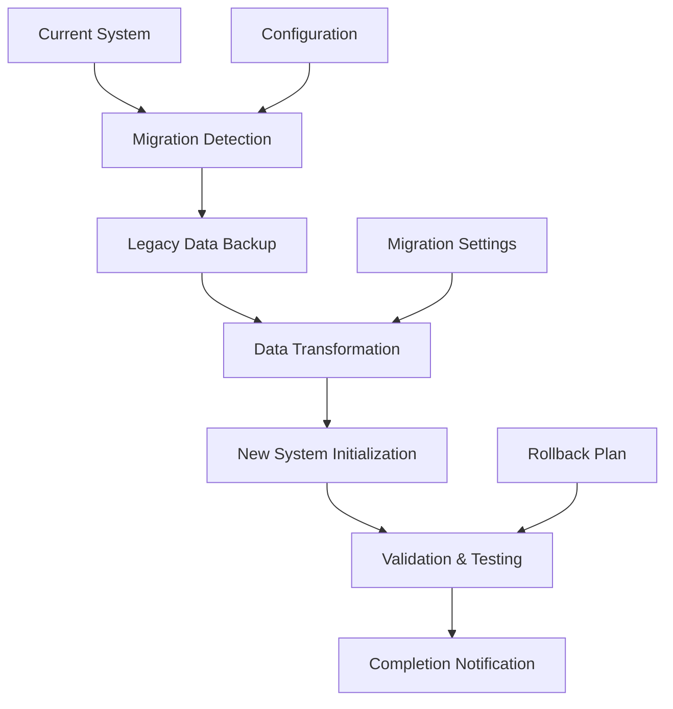

# Tribute System Migration Path

## Overview

This document details the migration path from the current gate-based tribute system to the new boost-based tribute framework. The migration is designed to be seamless, preserving player progress and ensuring a smooth transition while introducing the enhanced functionality of the new system.

## Migration Philosophy

1. **Progress Preservation** - No player progress should be lost during migration
2. **Seamless Transition** - Players should experience minimal disruption
3. **Backward Compatibility** - Support for legacy data during transition period
4. **Gradual Introduction** - New features introduced incrementally
5. **Rollback Capability** - Ability to revert if issues arise

## Migration Architecture



## Migration Phases

### Phase 1: Preparation (Development)

#### Legacy System Analysis
```java
public class LegacyTributeAnalyzer {
    // Analyze current tribute system data
    public static LegacyTributeData analyzeLegacyData(PetComponent component) {
        LegacyTributeData data = new LegacyTributeData();
        
        // Check for tribute milestones
        for (int level : new int[]{10, 20, 30}) {
            if (component.hasLegacyTributeMilestone(level)) {
                data.addMilestone(level, component.getLegacyTributeItem(level));
            }
        }
        
        // Check for tribute history
        if (component.hasLegacyTributeHistory()) {
            data.setHistory(component.getLegacyTributeHistory());
        }
        
        // Check for tribute-related attributes
        data.setAttributes(component.getLegacyTributeAttributes());
        
        return data;
    }
}
```

#### Migration Infrastructure
```java
public class TributeMigrationInfrastructure {
    // Initialize migration infrastructure
    public static void initializeMigration() {
        // Create migration directory
        createMigrationDirectory();
        
        // Initialize migration logger
        initializeMigrationLogger();
        
        // Create backup directory
        createBackupDirectory();
        
        // Initialize rollback system
        initializeRollbackSystem();
    }
    
    // Validate migration prerequisites
    public static boolean validatePrerequisites() {
        // Check available disk space
        if (!checkDiskSpace()) {
            Petsplus.LOGGER.error("Insufficient disk space for migration");
            return false;
        }
        
        // Check configuration compatibility
        if (!checkConfigurationCompatibility()) {
            Petsplus.LOGGER.error("Configuration not compatible with migration");
            return false;
        }
        
        // Check system stability
        if (!checkSystemStability()) {
            Petsplus.LOGGER.error("System not stable for migration");
            return false;
        }
        
        return true;
    }
}
```

### Phase 2: Implementation (Development)

#### Data Transformation Engine
```java
public class TributeDataTransformer {
    // Transform legacy tribute data to new format
    public static List<TributeData> transformLegacyData(LegacyTributeData legacyData) {
        List<TributeData> transformedData = new ArrayList<>();
        
        // Transform tribute milestones
        for (LegacyTributeMilestone milestone : legacyData.getMilestones()) {
            TributeData tributeData = transformMilestone(milestone);
            transformedData.add(tributeData);
        }
        
        // Transform tribute history
        for (LegacyTributeRecord record : legacyData.getHistory()) {
            TributeData tributeData = transformHistoryRecord(record);
            transformedData.add(tributeData);
        }
        
        // Transform tribute attributes
        if (legacyData.hasAttributes()) {
            TributeData tributeData = transformAttributes(legacyData.getAttributes());
            transformedData.add(tributeData);
        }
        
        return transformedData;
    }
    
    private static TributeData transformMilestone(LegacyTributeMilestone milestone) {
        // Map legacy milestone to equivalent tribute
        switch (milestone.getLevel()) {
            case 10:
                return TributeData.material("minecraft:gold_ingot", "uncommon");
            case 20:
                return TributeData.material("minecraft:diamond", "rare");
            case 30:
                return TributeData.material("minecraft:netherite_scrap", "epic");
            default:
                return TributeData.material("minecraft:iron_ingot", "common");
        }
    }
}
```

#### Migration Validation System
```java
public class MigrationValidator {
    // Validate migration results
    public static ValidationResult validateMigration(PetComponent component, List<TributeData> transformedData) {
        ValidationResult result = new ValidationResult();
        
        // Validate data integrity
        if (!validateDataIntegrity(component, transformedData)) {
            result.addError("Data integrity validation failed");
        }
        
        // Validate effect equivalence
        if (!validateEffectEquivalence(component, transformedData)) {
            result.addError("Effect equivalence validation failed");
        }
        
        // Validate system compatibility
        if (!validateSystemCompatibility(transformedData)) {
            result.addError("System compatibility validation failed");
        }
        
        // Validate performance impact
        if (!validatePerformanceImpact(transformedData)) {
            result.addWarning("Performance impact may be significant");
        }
        
        return result;
    }
}
```

### Phase 3: Deployment (Release)

#### Automatic Migration System
```java
public class AutomaticMigrationSystem {
    // Automatically migrate pets on first load
    public static void migratePetOnLoad(PetComponent component) {
        // Check if migration is needed
        if (!needsMigration(component)) {
            return;
        }
        
        // Create backup
        createBackup(component);
        
        // Perform migration
        MigrationResult result = performMigration(component);
        
        // Handle migration result
        if (result.isSuccess()) {
            // Log successful migration
            logSuccessfulMigration(component, result);
            
            // Notify player
            notifyPlayerOfMigration(component.getOwner(), result);
        } else {
            // Handle migration failure
            handleMigrationFailure(component, result);
        }
    }
    
    private static boolean needsMigration(PetComponent component) {
        // Check for legacy tribute data
        return component.hasLegacyTributeData() && !component.hasMigratedTributeData();
    }
    
    private static MigrationResult performMigration(PetComponent component) {
        try {
            // Analyze legacy data
            LegacyTributeData legacyData = LegacyTributeAnalyzer.analyzeLegacyData(component);
            
            // Transform data
            List<TributeData> transformedData = TributeDataTransformer.transformLegacyData(legacyData);
            
            // Apply transformed data
            applyTransformedData(component, transformedData);
            
            // Validate migration
            ValidationResult validation = MigrationValidator.validateMigration(component, transformedData);
            
            if (validation.hasErrors()) {
                return MigrationResult.failure(validation.getErrors());
            }
            
            // Mark migration as complete
            component.setMigratedTributeData(true);
            
            return MigrationResult.success(transformedData, validation.getWarnings());
            
        } catch (Exception e) {
            Petsplus.LOGGER.error("Migration failed for pet " + component.getPetId(), e);
            return MigrationResult.failure("Migration exception: " + e.getMessage());
        }
    }
}
```

#### Migration Notification System
```java
public class MigrationNotificationSystem {
    // Notify player of migration results
    public static void notifyPlayerOfMigration(ServerPlayerEntity player, MigrationResult result) {
        if (result.isSuccess()) {
            // Send success message
            player.sendMessage(
                Text.literal("Your pet has been upgraded to the new tribute system!")
                    .formatted(Formatting.GREEN),
                false
            );
            
            // Send migration summary
            sendMigrationSummary(player, result);
            
            // Send new features introduction
            sendNewFeaturesIntroduction(player);
        } else {
            // Send failure message
            player.sendMessage(
                Text.literal("Pet tribute system migration failed. Please contact an administrator.")
                    .formatted(Formatting.RED),
                false
            );
        }
    }
    
    private static void sendMigrationSummary(ServerPlayerEntity player, MigrationResult result) {
        Text summary = Text.literal("Migration Summary:")
            .formatted(Formatting.YELLOW)
            .append(Text.literal("\n• Converted " + result.getTransformedData().size() + " tribute effects")
                .formatted(Formatting.WHITE))
            .append(Text.literal("\n• All pet progress preserved")
                .formatted(Formatting.WHITE))
            .append(Text.literal("\n• New tribute features now available")
                .formatted(Formatting.WHITE));
        
        player.sendMessage(summary, false);
    }
}
```

### Phase 4: Stabilization (Post-Release)

#### Monitoring System
```java
public class MigrationMonitoringSystem {
    // Monitor migration performance and issues
    public static void monitorMigration() {
        // Collect migration statistics
        MigrationStatistics stats = collectMigrationStatistics();
        
        // Check for issues
        if (stats.hasIssues()) {
            reportMigrationIssues(stats);
        }
        
        // Optimize performance
        if (stats.hasPerformanceIssues()) {
            optimizeMigrationPerformance(stats);
        }
        
        // Generate migration report
        generateMigrationReport(stats);
    }
    
    private static MigrationStatistics collectMigrationStatistics() {
        MigrationStatistics stats = new MigrationStatistics();
        
        // Collect migration count
        stats.setMigrationCount(getMigrationCount());
        
        // Collect success rate
        stats.setSuccessRate(getSuccessRate());
        
        // Collect performance metrics
        stats.setPerformanceMetrics(getPerformanceMetrics());
        
        // Collect error reports
        stats.setErrorReports(getErrorReports());
        
        return stats;
    }
}
```

#### Rollback System
```java
public class MigrationRollbackSystem {
    // Rollback migration if needed
    public static boolean rollbackMigration(PetComponent component) {
        try {
            // Check if rollback is possible
            if (!canRollback(component)) {
                Petsplus.LOGGER.error("Rollback not possible for pet " + component.getPetId());
                return false;
            }
            
            // Restore backup
            restoreBackup(component);
            
            // Clear new system data
            clearNewSystemData(component);
            
            // Mark as not migrated
            component.setMigratedTributeData(false);
            
            // Log rollback
            logRollback(component);
            
            return true;
            
        } catch (Exception e) {
            Petsplus.LOGGER.error("Rollback failed for pet " + component.getPetId(), e);
            return false;
        }
    }
    
    private static boolean canRollback(PetComponent component) {
        // Check if backup exists
        if (!backupExists(component)) {
            return false;
        }
        
        // Check if rollback time limit has not passed
        if (rollbackTimeLimitExceeded(component)) {
            return false;
        }
        
        // Check if new system data can be safely cleared
        if (!canClearNewSystemData(component)) {
            return false;
        }
        
        return true;
    }
}
```

## Migration Configuration

### Migration Settings
**Location**: `config/petsplus/migration_settings.json`

```json
{
  "version": 1,
  "migration_settings": {
    "enabled": true,
    "auto_migrate": true,
    "backup_enabled": true,
    "rollback_enabled": true,
    "rollback_time_limit": 7200,
    "validation_enabled": true,
    "notification_enabled": true
  },
  "legacy_conversion": {
    "tribute_milestones": {
      "10": {
        "equivalent_tribute": {
          "item": "minecraft:gold_ingot",
          "category": "material",
          "rarity": "uncommon",
          "effects": ["health_boost", "defense_boost"],
          "flavor_text": "A symbol of your journey together"
        }
      },
      "20": {
        "equivalent_tribute": {
          "item": "minecraft:diamond",
          "category": "material",
          "rarity": "rare",
          "effects": ["health_boost", "attack_boost", "defense_boost"],
          "flavor_text": "A testament to your growing bond"
        }
      },
      "30": {
        "equivalent_tribute": {
          "item": "minecraft:netherite_scrap",
          "category": "material",
          "rarity": "epic",
          "effects": ["health_boost", "attack_boost", "defense_boost", "special_power"],
          "flavor_text": "The ultimate symbol of your partnership"
        }
      }
    }
  },
  "compatibility_settings": {
    "preserve_progress": true,
    "preserve_history": true,
    "preserve_preferences": true,
    "preserve_relationships": true,
    "preserve_appearance": true
  }
}
```

## Data Transformation Maps

### Legacy to New System Mapping
```java
public class LegacyToNewMapping {
    // Map legacy tribute milestones to new system equivalents
    public static final Map<Integer, TributeData> MILESTONE_MAPPING = Map.of(
        10, TributeData.builder()
            .itemId(new Identifier("minecraft:gold_ingot"))
            .category("material")
            .rarity("uncommon")
            .effects(Map.of(
                "health_boost", 2.0f,
                "defense_boost", 1.5f
            ))
            .flavorText("A symbol of your journey together")
            .build(),
            
        20, TributeData.builder()
            .itemId(new Identifier("minecraft:diamond"))
            .category("material")
            .rarity("rare")
            .effects(Map.of(
                "health_boost", 4.0f,
                "attack_boost", 3.0f,
                "defense_boost", 3.0f
            ))
            .flavorText("A testament to your growing bond")
            .build(),
            
        30, TributeData.builder()
            .itemId(new Identifier("minecraft:netherite_scrap"))
            .category("material")
            .rarity("epic")
            .effects(Map.of(
                "health_boost", 6.0f,
                "attack_boost", 5.0f,
                "defense_boost", 5.0f,
                "special_power", 1.0f
            ))
            .flavorText("The ultimate symbol of your partnership")
            .build()
    );
}
```

## Testing and Validation

### Migration Test Suite
```java
public class MigrationTestSuite {
    // Comprehensive migration testing
    @Test
    public void testLegacyDataTransformation() {
        // Create test legacy data
        LegacyTributeData legacyData = createTestLegacyData();
        
        // Transform data
        List<TributeData> transformedData = TributeDataTransformer.transformLegacyData(legacyData);
        
        // Validate transformation
        assertEquals(3, transformedData.size());
        assertTrue(transformedData.stream().anyMatch(data -> data.getItemId().equals(new Identifier("minecraft:gold_ingot"))));
        assertTrue(transformedData.stream().anyMatch(data -> data.getItemId().equals(new Identifier("minecraft:diamond"))));
        assertTrue(transformedData.stream().anyMatch(data -> data.getItemId().equals(new Identifier("minecraft:netherite_scrap"))));
    }
    
    @Test
    public void testMigrationValidation() {
        // Create test pet component
        PetComponent component = createTestPetComponent();
        
        // Create test transformed data
        List<TributeData> transformedData = createTestTransformedData();
        
        // Validate migration
        ValidationResult result = MigrationValidator.validateMigration(component, transformedData);
        
        // Validate result
        assertTrue(result.isValid());
        assertFalse(result.hasErrors());
    }
    
    @Test
    public void testRollbackCapability() {
        // Create test pet component
        PetComponent component = createTestPetComponent();
        
        // Perform migration
        MigrationResult result = AutomaticMigrationSystem.performMigration(component);
        assertTrue(result.isSuccess());
        
        // Test rollback
        boolean rollbackSuccess = MigrationRollbackSystem.rollbackMigration(component);
        assertTrue(rollbackSuccess);
        
        // Validate rollback
        assertFalse(component.hasMigratedTributeData());
        assertTrue(component.hasLegacyTributeData());
    }
}
```

## Performance Considerations

### Migration Optimization
```java
public class MigrationOptimizer {
    // Optimize migration performance
    public static void optimizeMigration() {
        // Batch migration support for multiple pets
        enableBatchMigration();
        
        // Asynchronous migration for large servers
        enableAsyncMigration();
        
        // Progress tracking for long migrations
        enableProgressTracking();
        
        // Resource usage monitoring
        enableResourceMonitoring();
    }
    
    private static void enableBatchMigration() {
        // Process multiple pets in single operation
        // Reduces overhead for servers with many pets
    }
    
    private static void enableAsyncMigration() {
        // Process migrations asynchronously
        // Prevents server blocking during large migrations
    }
    
    private static void enableProgressTracking() {
        // Track migration progress
        // Provides feedback for long-running operations
    }
}
```

## User Communication

### Migration Guide for Players
```
=== Tribute System Migration ===

Your pet's tribute system has been upgraded!

What Changed:
• Tribute gates are now tribute boosts
• Any item can be offered as tribute
• Tributes provide permanent enhancements
• New visual and audio effects
• Expanded tribute options

What Stayed The Same:
• All your pet's progress is preserved
• Bond with your pet remains unchanged
• Pet abilities and level remain the same
• Your pet's appearance and personality

What's New:
• Offer any item as tribute
• Category-based tribute effects
• Rarity-based power scaling
• Tribute history and biography
• Special tribute celebrations

How to Use:
1. Sneak + right-click your pet
2. Hold any item in your hand
3. Your pet will respond with appropriate effects
4. Check pet inspection for tribute details

Questions? Ask in chat or check the wiki!
```

## Conclusion

The migration path from the current gate-based tribute system to the new boost-based framework is designed to be seamless and non-disruptive. The migration preserves all player progress while introducing enhanced functionality that provides more flexibility, choice, and emotional connection.

The phased approach ensures thorough testing and validation at each stage, while the rollback capability provides a safety net in case of unexpected issues. The automatic migration system ensures that all players benefit from the new system without requiring manual intervention.

The migration represents a significant enhancement to the PetsPlus experience, transforming tributes from gate-based progression blockers into meaningful, flexible enhancement opportunities that strengthen the emotional connection between players and their pets.