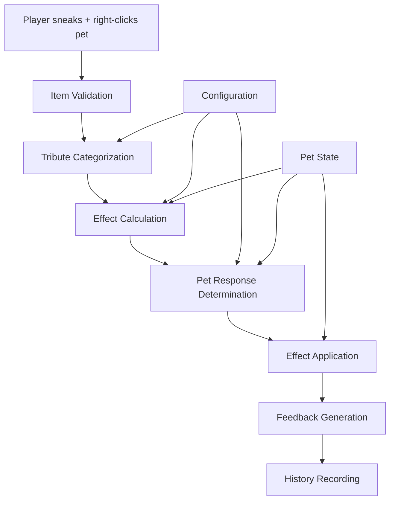

# Tribute Offering and Acceptance Mechanics

## Overview

This document details the tribute offering and acceptance mechanics that define how players interact with the tribute system. The mechanics provide intuitive, natural interactions that integrate seamlessly with existing Minecraft gameplay while creating meaningful moments of connection between players and their pets.

## Design Goals

1. **Natural Interaction** - Use existing Minecraft interaction patterns
2. **Intuitive Feedback** - Players should understand what's happening
3. **Flexible Acceptance** - Any item can be offered, with appropriate responses
4. **Emotional Connection** - Create moments of bonding between player and pet
5. **Emergent Storytelling** - Tribute patterns create pet biography

## Interaction Flow



## Offering Mechanics

### Input Detection

#### Primary Interaction Method
- **Action**: Sneak + Right-click on pet
- **Requirement**: Player must be pet owner
- **Item**: Any item in hand (including empty hand)
- **Range**: Standard Minecraft interaction range

#### Alternative Interaction Methods
- **Secondary**: Sneak + Right-click with empty hand (pet-specific response)
- **Tertiary**: Right-click with specific items (automatic tribute offering)
- **Configuration**: Customizable interaction methods per server

### Validation Process

#### Ownership Validation
```java
public static boolean validateOwnership(PlayerEntity player, MobEntity pet) {
    PetComponent component = PetComponent.get(pet);
    return component != null && component.isOwnedBy(player);
}
```

#### Item Validation
```java
public static boolean validateItem(ItemStack stack) {
    // Any item can be offered - no hard restrictions
    // Empty hand triggers special interaction
    return true;
}
```

#### Context Validation
```java
public static boolean validateContext(PlayerEntity player, MobEntity pet) {
    // Check if pet is in appropriate state for tribute
    PetComponent component = PetComponent.get(pet);
    return component != null && 
           pet.isAlive() && 
           !pet.isRemoved() &&
           !component.isInCombat();
}
```

## Tribute Categorization

### Automatic Category Detection
```java
public class TributeCategorizer {
    public static TributeData categorize(ItemStack stack) {
        // Check for explicit configuration overrides
        TributeData override = checkConfigurationOverrides(stack);
        if (override != null) {
            return override;
        }
        
        // Automatic categorization based on item properties
        if (isMaterialItem(stack)) {
            return createMaterialTribute(stack);
        } else if (isFoodItem(stack)) {
            return createFoodTribute(stack);
        } else if (isMagicalItem(stack)) {
            return createMagicalTribute(stack);
        } else {
            return createSpecialTribute(stack);
        }
    }
}
```

### Rarity Assessment
```java
public class RarityAssessor {
    public static String assessRarity(ItemStack stack, TributeData data) {
        // Check for explicit rarity configuration
        String configuredRarity = getConfiguredRarity(stack);
        if (configuredRarity != null) {
            return configuredRarity;
        }
        
        // Calculate rarity based on item properties
        return calculateRarity(stack, data);
    }
}
```

## Pet Response System

### Response Categories

#### Positive Responses
- **Acceptance**: Pet accepts tribute and receives boost
- **Enthusiasm**: Pet particularly likes the tribute (enhanced effects)
- **Affection**: Pet shows special affection (bond boost)
- **Celebration**: Pet celebrates special tribute (unique effects)

#### Neutral Responses
- **Tolerance**: Pet accepts but doesn't particularly like the tribute
- **Curiosity**: Pet is curious about unusual tribute
- **Indifference**: Pet doesn't care much about the tribute

#### Negative Responses
- **Rejection**: Pet refuses the tribute (no effects)
- **Dislike**: Pet accepts but with reduced effects
- **Fear**: Pet is afraid of the tribute (mood penalty)

### Response Determination
```java
public class ResponseDeterminer {
    public static PetResponse determineResponse(
        ItemStack stack, 
        TributeData data, 
        PetComponent component,
        PetRoleType roleType
    ) {
        // Calculate base response score
        float responseScore = calculateBaseResponseScore(stack, data, component, roleType);
        
        // Apply modifiers based on pet state
        responseScore = applyStateModifiers(responseScore, component);
        
        // Apply modifiers based on tribute history
        responseScore = applyHistoryModifiers(responseScore, component, data);
        
        // Convert score to response category
        return scoreToResponse(responseScore);
    }
}
```

### Response Behaviors

#### Visual Behaviors
- **Acceptance**: Tail wag, head tilt, happy particles
- **Enthusiasm**: Jumping, spinning, excited particles
- **Affection**: Nuzzling, licking, heart particles
- **Celebration**: Special animation, fireworks particles

#### Audio Behaviors
- **Acceptance**: Happy sound, purr, contented noise
- **Enthusiasm**: Excited bark, happy yelp
- **Affection**: Purring, affectionate sounds
- **Celebration**: Special sound effect, musical note

#### AI Behaviors
- **Acceptance**: Temporary follow bonus, increased proximity
- **Enthusiasm**: Play behavior, increased activity
- **Affection**: Extended following, protective behavior
- **Celebration**: Special ability use, unique behavior

## Effect Application System

### Application Process
```java
public class EffectApplication {
    public static void applyEffects(
        MobEntity pet,
        PetComponent component,
        TributeData data,
        PetResponse response
    ) {
        // Calculate effect values based on tribute and response
        Map<String, Float> effects = calculateEffects(data, response, component);
        
        // Apply attribute effects
        applyAttributeEffects(pet, component, effects);
        
        // Apply mood effects
        applyMoodEffects(component, effects);
        
        // Apply bond effects
        applyBondEffects(component, effects);
        
        // Apply ability effects
        applyAbilityEffects(component, effects);
        
        // Apply special effects
        applySpecialEffects(pet, component, effects);
        
        // Record tribute in history
        recordTribute(component, data, response, effects);
    }
}
```

### Response-Based Effect Modification
```java
public class EffectModifier {
    public static Map<String, Float> modifyEffects(
        Map<String, Float> baseEffects,
        PetResponse response
    ) {
        Map<String, Float> modifiedEffects = new HashMap<>(baseEffects);
        
        switch (response.getType()) {
            case ENTHUSIASM:
                // Boost all effects by 25%
                modifiedEffects.replaceAll((k, v) -> v * 1.25f);
                break;
            case AFFECTION:
                // Add special bond boost
                modifiedEffects.put("bond_strength", modifiedEffects.getOrDefault("bond_strength", 0f) + 1.0f);
                break;
            case CELEBRATION:
                // Add unique celebration effect
                modifiedEffects.put("celebration_bonus", 1.0f);
                break;
            case DISLIKE:
                // Reduce all effects by 50%
                modifiedEffects.replaceAll((k, v) -> v * 0.5f);
                break;
            case REJECTION:
                // No effects applied
                return new HashMap<>();
        }
        
        return modifiedEffects;
    }
}
```

## Feedback System

### Immediate Feedback

#### Visual Feedback
- **Particles**: Category and rarity-specific particle effects
- **Animations**: Pet-specific response animations
- **Effects**: Visual indicators of applied boosts
- **Text**: Hover text showing tribute effects

#### Audio Feedback
- **Response Sounds**: Category-specific response sounds
- **Rarity Pitch**: Sound pitch varies by rarity
- **Completion Sounds**: Special sounds for successful tributes
- **Failure Sounds**: Appropriate sounds for rejected tributes

#### UI Feedback
- **Action Bar**: Brief message about tribute result
- **Chat**: Detailed description of significant effects
- **Boss Bar**: Temporary indicator for major tributes
- **Toast Notifications**: Visual indicators for special events

### Persistent Feedback

#### Tribute Indicators
- **Particle Effects**: Subtle ongoing effects for active boosts
- **Visual Markers**: Pet appearance changes for special tributes
- **Behavior Changes**: AI modifications reflecting tribute effects
- **Accessory Items**: Visual items representing special tributes

#### Status Information
- **Inspection UI**: Detailed tribute history and active effects
- **Pet Menu**: Tribute-related information in pet interface
- **Comparison Tool**: Tooltips showing potential tribute effects
- **Progress Tracking**: Visual indicators of tribute progression

## Special Interaction Mechanics

### Empty Hand Interaction
```java
public static void handleEmptyHandInteraction(PlayerEntity player, MobEntity pet) {
    PetComponent component = PetComponent.get(pet);
    
    // Check for special conditions
    if (component.hasRecentTributes()) {
        // Pet shows appreciation for recent tributes
        showAppreciationBehavior(pet, component);
    } else {
        // Pet shows desire for tribute
        showDesireBehavior(pet, component);
    }
}
```

### Multiple Item Offering
```java
public static void handleMultipleItemOffering(PlayerEntity player, MobEntity pet, List<ItemStack> items) {
    // Calculate combined tribute value
    float combinedValue = calculateCombinedValue(items);
    
    // Apply synergy bonuses for related items
    float synergyBonus = calculateSynergyBonus(items);
    
    // Create special composite tribute
    TributeData compositeTribute = createCompositeTribute(items, combinedValue + synergyBonus);
    
    // Apply composite effects
    applyTributeEffects(pet, compositeTribute);
}
```

### Ritual Offering
```java
public static void handleRitualOffering(PlayerEntity player, MobEntity pet, RitualPattern pattern) {
    // Validate ritual pattern
    if (validateRitualPattern(pattern)) {
        // Apply special ritual effects
        applyRitualEffects(pet, pattern);
        
        // Trigger special behaviors
        triggerRitualBehaviors(pet, pattern);
        
        // Record ritual in history
        recordRitual(pet, pattern);
    }
}
```

## Advanced Features

### Tribute Preferences
```java
public class TributePreferences {
    // Track pet preferences based on tribute history
    private final Map<String, Float> categoryPreferences = new HashMap<>();
    private final Map<String, Float> itemPreferences = new HashMap<>();
    
    // Update preferences based on pet responses
    public void updatePreferences(String category, String item, PetResponse response) {
        float adjustment = getResponseAdjustment(response);
        categoryPreferences.merge(category, adjustment, Float::sum);
        itemPreferences.merge(item, adjustment, Float::sum);
    }
    
    // Get preference score for tribute prediction
    public float getPreferenceScore(String category, String item) {
        return categoryPreferences.getOrDefault(category, 0f) + 
               itemPreferences.getOrDefault(item, 0f);
    }
}
```

### Tribute Memory
```java
public class TributeMemory {
    // Track significant tributes for special behaviors
    private final List<SignificantTribute> significantTributes = new ArrayList<>();
    
    // Check for tribute pattern recognition
    public boolean recognizePattern(List<TributeData> recentTributes) {
        // Implement pattern recognition logic
        return checkPattern(recentTributes);
    }
    
    // Trigger memory-based behaviors
    public void triggerMemoryBehavior(MobEntity pet, ItemStack currentItem) {
        // Check if current item matches significant memory
        SignificantTribute memory = findMatchingMemory(currentItem);
        if (memory != null) {
            triggerMemoryResponse(pet, memory);
        }
    }
}
```

### Dynamic Response Learning
```java
public class ResponseLearning {
    // Track player tribute patterns
    private final Map<UUID, PlayerTributeProfile> playerProfiles = new HashMap<>();
    
    // Learn from player behavior
    public void learnFromTribute(UUID playerId, TributeData tribute, PetResponse response) {
        PlayerTributeProfile profile = playerProfiles.computeIfAbsent(playerId, k -> new PlayerTributeProfile());
        profile.recordTribute(tribute, response);
    }
    
    // Predict optimal tribute for player
    public ItemStack predictOptimalTribute(UUID playerId, MobEntity pet) {
        PlayerTributeProfile profile = playerProfiles.get(playerId);
        if (profile != null) {
            return profile.getOptimalTribute(pet);
        }
        return null;
    }
}
```

## Configuration System

### Interaction Configuration
```json
{
  "interaction_settings": {
    "primary_method": "sneak_right_click",
    "require_ownership": true,
    "require_sneaking": true,
    "allow_empty_hand": true,
    "interaction_range": 5.0,
    "cooldown_ticks": 20
  },
  "response_settings": {
    "positive_response_chance": 0.8,
    "enthusiasm_threshold": 0.7,
    "affection_threshold": 0.9,
    "celebration_threshold": 0.95,
    "rejection_chance": 0.05
  }
}
```

### Behavior Configuration
```json
{
  "behavior_settings": {
    "visual_feedback_duration": 60,
    "particle_effects_enabled": true,
    "sound_effects_enabled": true,
    "ui_feedback_enabled": true,
    "persistent_indicators": true
  },
  "advanced_features": {
    "tribute_preferences": true,
    "tribute_memory": true,
    "pattern_recognition": true,
    "dynamic_learning": true
  }
}
```

## Integration with Existing Systems

### TributeHandler Integration
```java
public class TributeHandler {
    public static void onUseEntity(PlayerEntity player, Hand hand, Entity entity, EntityHitResult hitResult) {
        if (entity instanceof MobEntity mob) {
            // Check if interaction is tribute offering
            if (isTributeOffering(player, hand, mob)) {
                // Handle tribute offering
                handleTributeOffering(player, hand, mob);
            }
        }
    }
    
    private static boolean isTributeOffering(PlayerEntity player, Hand hand, MobEntity mob) {
        // Check interaction conditions
        return player.isSneaking() && 
               validateOwnership(player, mob) &&
               validateContext(player, mob);
    }
}
```

### PetComponent Integration
```java
public class PetComponent {
    // Store tribute history
    private final List<TributeRecord> tributeHistory = new ArrayList<>();
    
    // Store active tribute effects
    private final Map<String, TributeEffect> activeEffects = new HashMap<>();
    
    // Store tribute preferences
    private final TributePreferences preferences = new TributePreferences();
    
    // Store tribute memory
    private final TributeMemory memory = new TributeMemory();
    
    // Apply tribute effects
    public void applyTribute(TributeData data, PetResponse response) {
        // Record tribute
        recordTribute(data, response);
        
        // Apply effects
        TributeEffect effect = new TributeEffect(data, response);
        activeEffects.put(data.getItemId(), effect);
        
        // Update preferences
        preferences.updatePreferences(data.getCategory(), data.getItemId(), response);
        
        // Update memory
        memory.recordTribute(data, response);
    }
}
```

## Balance Considerations

### Interaction Balance
- No tribute should be completely worthless
- Common items should provide meaningful but small benefits
- Rare items should provide significant but not game-breaking advantages
- Player choice should be more important than item rarity

### Response Balance
- Most tributes should be accepted (positive experience)
- Negative responses should be reserved for inappropriate tributes
- Response should reflect pet personality and role
- Consistent patterns should build pet preferences

### Progression Balance
- Tribute effects should complement existing progression
- No tribute should replace core progression mechanics
- Tribute effects should provide alternative advancement paths
- Player investment should be rewarded appropriately

## Conclusion

The tribute offering and acceptance mechanics provide a natural, intuitive interface for players to enhance their pets through tribute offerings. The system creates meaningful moments of connection between players and their pets while maintaining balance and integration with existing Minecraft gameplay patterns.

The mechanics are designed to be flexible and configurable, allowing server administrators to customize the experience to their specific needs while maintaining the core design principles of natural interaction and emotional connection.