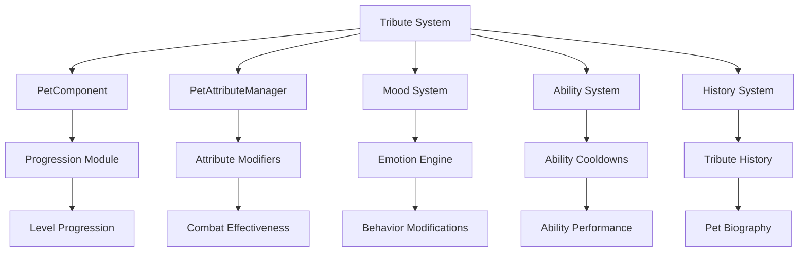

# Tribute System Integration with Pet Progression

## Overview

This document details how the tribute boost system integrates with existing PetsPlus progression systems. The integration ensures that tribute effects complement rather than replace existing progression mechanics, creating a layered enhancement system that provides depth without complexity.

## Integration Architecture



## PetComponent Integration

### Tribute Module Addition
```java
public class PetComponent {
    // Existing modules
    private final ProgressionModule progressionModule;
    private final CharacteristicsModule characteristicsModule;
    private final EmotionModule emotionModule;
    
    // New tribute module
    private final TributeModule tributeModule;
    
    // Initialize tribute module
    private void initializeModules() {
        // Existing initialization
        this.progressionModule = new DefaultProgressionModule();
        this.characteristicsModule = new DefaultCharacteristicsModule();
        this.emotionModule = new DefaultEmotionModule();
        
        // New tribute module
        this.tributeModule = new DefaultTributeModule();
    }
}
```

### Tribute Module Interface
```java
public interface TributeModule {
    // Apply tribute effects
    void applyTribute(TributeData data, PetResponse response);
    
    // Get active tribute effects
    Map<String, TributeEffect> getActiveEffects();
    
    // Get tribute history
    List<TributeRecord> getTributeHistory();
    
    // Get tribute preferences
    TributePreferences getPreferences();
    
    // Get tribute memory
    TributeMemory getMemory();
    
    // Clear all tribute effects (on death)
    void clearEffects();
    
    // Serialize/deserialize for persistence
    void serialize(JsonObject json);
    void deserialize(JsonObject json);
}
```

### Tribute Module Implementation
```java
public class DefaultTributeModule implements TributeModule {
    // Active tribute effects
    private final Map<String, TributeEffect> activeEffects = new HashMap<>();
    
    // Tribute history
    private final List<TributeRecord> tributeHistory = new ArrayList<>();
    
    // Tribute preferences
    private final TributePreferences preferences = new TributePreferences();
    
    // Tribute memory
    private final TributeMemory memory = new TributeMemory();
    
    @Override
    public void applyTribute(TributeData data, PetResponse response) {
        // Create tribute effect
        TributeEffect effect = new TributeEffect(data, response);
        
        // Store active effect
        activeEffects.put(data.getItemId(), effect);
        
        // Record in history
        TributeRecord record = new TributeRecord(data, response, System.currentTimeMillis());
        tributeHistory.add(record);
        
        // Update preferences
        preferences.updatePreferences(data.getCategory(), data.getItemId(), response);
        
        // Update memory
        memory.recordTribute(data, response);
        
        // Apply effects to other systems
        applyEffectsToOtherSystems(effect);
    }
    
    private void applyEffectsToOtherSystems(TributeEffect effect) {
        // Apply attribute effects
        applyAttributeEffects(effect);
        
        // Apply mood effects
        applyMoodEffects(effect);
        
        // Apply ability effects
        applyAbilityEffects(effect);
    }
}
```

## Attribute System Integration

### tributeAttributeManager Extension
```java
public class PetAttributeManager {
    // Existing attribute application
    public static void applyAttributeModifiers(MobEntity pet, PetComponent petComponent) {
        // Remove existing modifiers
        removeAttributeModifiers(pet);
        
        // Apply level-based modifiers
        applyLevelModifiers(pet, petComponent);
        
        // Apply characteristic-based modifiers
        applyCharacteristicModifiers(pet, petComponent);
        
        // Apply permanent stat boost modifiers
        applyPermanentStatBoosts(pet, petComponent);
        
        // Apply nature-based modifiers
        applyNatureModifiers(pet, petComponent);
        
        // NEW: Apply tribute-based modifiers
        applyTributeModifiers(pet, petComponent);
    }
    
    // NEW: Apply tribute-based attribute modifiers
    private static void applyTributeModifiers(MobEntity pet, PetComponent petComponent) {
        TributeModule tributeModule = petComponent.getTributeModule();
        if (tributeModule == null) return;
        
        Map<String, TributeEffect> activeEffects = tributeModule.getActiveEffects();
        
        // Apply health boosts
        float healthBoost = calculateTributeHealthBoost(activeEffects);
        if (healthBoost > 0) {
            applyHealthBoost(pet, healthBoost);
        }
        
        // Apply defense boosts
        float defenseBoost = calculateTributeDefenseBoost(activeEffects);
        if (defenseBoost > 0) {
            applyDefenseBoost(pet, defenseBoost);
        }
        
        // Apply attack boosts
        float attackBoost = calculateTributeAttackBoost(activeEffects);
        if (attackBoost > 0) {
            applyAttackBoost(pet, attackBoost);
        }
        
        // Apply speed boosts
        float speedBoost = calculateTributeSpeedBoost(activeEffects);
        if (speedBoost > 0) {
            applySpeedBoost(pet, speedBoost);
        }
    }
    
    // Calculate tribute attribute boosts
    private static float calculateTributeHealthBoost(Map<String, TributeEffect> activeEffects) {
        float totalBoost = 0f;
        
        for (TributeEffect effect : activeEffects.values()) {
            Map<String, Float> effects = effect.getEffects();
            totalBoost += effects.getOrDefault("health_boost", 0f);
        }
        
        // Apply diminishing returns
        return applyDiminishingReturns(totalBoost);
    }
}
```

### Attribute Modifiers Calculation
```java
public class TributeAttributeCalculator {
    // Calculate total attribute boost from all tributes
    public static float calculateAttributeBoost(
        String attributeType, 
        Map<String, TributeEffect> activeEffects,
        PetRoleType roleType
    ) {
        float totalBoost = 0f;
        
        for (TributeEffect effect : activeEffects.values()) {
            Map<String, Float> effects = effect.getEffects();
            float boost = effects.getOrDefault(attributeType + "_boost", 0f);
            
            // Apply role affinity bonus
            float roleMultiplier = getRoleAffinityMultiplier(effect.getData().getCategory(), roleType);
            boost *= roleMultiplier;
            
            // Apply response modifier
            float responseMultiplier = getResponseMultiplier(effect.getResponse());
            boost *= responseMultiplier;
            
            totalBoost += boost;
        }
        
        // Apply diminishing returns
        return applyDiminishingReturns(totalBoost);
    }
    
    // Apply diminishing returns to prevent exploitation
    private static float applyDiminishingReturns(float boost) {
        // First tribute: 100% effectiveness
        // Second tribute: 90% effectiveness
        // Third tribute: 70% effectiveness
        // Fourth+: 50% effectiveness
        if (boost <= 1.0f) return boost;
        if (boost <= 2.0f) return 1.0f + (boost - 1.0f) * 0.9f;
        if (boost <= 3.0f) return 1.9f + (boost - 2.0f) * 0.7f;
        return 2.6f + (boost - 3.0f) * 0.5f;
    }
}
```

## Mood System Integration

### Emotion Engine Extension
```java
public class PetMoodEngine {
    // Existing mood processing
    public void processEmotions(MobEntity pet, PetComponent component, long time) {
        // Process existing emotion sources
        processEnvironmentEmotions(pet, component, time);
        processCombatEmotions(pet, component, time);
        processInteractionEmotions(pet, component, time);
        
        // NEW: Process tribute-based emotions
        processTributeEmotions(pet, component, time);
    }
    
    // NEW: Process tribute-based emotions
    private void processTributeEmotions(MobEntity pet, PetComponent component, long time) {
        TributeModule tributeModule = component.getTributeModule();
        if (tributeModule == null) return;
        
        Map<String, TributeEffect> activeEffects = tributeModule.getActiveEffects();
        
        // Apply persistent mood boosts
        for (TributeEffect effect : activeEffects.values()) {
            Map<String, Float> effects = effect.getEffects();
            
            // Apply joy boost
            float joyBoost = effects.getOrDefault("joy_boost", 0f);
            if (joyBoost > 0) {
                component.addEmotion(PetComponent.Emotion.JOY, joyBoost * 0.01f, time);
            }
            
            // Apply confidence boost
            float confidenceBoost = effects.getOrDefault("confidence_boost", 0f);
            if (confidenceBoost > 0) {
                component.addEmotion(PetComponent.Emotion.CONFIDENCE, confidenceBoost * 0.01f, time);
            }
            
            // Apply wonder boost
            float wonderBoost = effects.getOrDefault("wonder_boost", 0f);
            if (wonderBoost > 0) {
                component.addEmotion(PetComponent.Emotion.WONDER, wonderBoost * 0.01f, time);
            }
        }
        
        // Apply mood resilience
        float moodResilience = calculateTributeMoodResilience(activeEffects);
        component.setMoodResilience(component.getMoodResilience() + moodResilience);
    }
    
    // Calculate mood resilience from tributes
    private float calculateTributeMoodResilience(Map<String, TributeEffect> activeEffects) {
        float totalResilience = 0f;
        
        for (TributeEffect effect : activeEffects.values()) {
            Map<String, Float> effects = effect.getEffects();
            totalResilience += effects.getOrDefault("mood_resilience", 0f);
        }
        
        // Cap resilience at reasonable level
        return Math.min(totalResilience, 0.5f);
    }
}
```

### Emotional Response to Tributes
```java
public class TributeEmotionHandler {
    // Generate emotional response to tribute offering
    public static void generateTributeEmotion(
        MobEntity pet, 
        PetComponent component, 
        TributeData data, 
        PetResponse response
    ) {
        // Base emotion based on response
        PetComponent.Emotion baseEmotion = getBaseEmotion(response);
        
        // Intensity based on tribute value
        float intensity = calculateEmotionIntensity(data, response);
        
        // Duration based on tribute rarity
        int duration = calculateEmotionDuration(data);
        
        // Apply emotion to pet
        component.addEmotion(baseEmotion, intensity, System.currentTimeMillis(), duration);
        
        // Apply special effects for exceptional tributes
        if (response.getType() == PetResponse.Type.CELEBRATION) {
            generateSpecialEmotions(pet, component, data);
        }
    }
    
    // Get base emotion from response type
    private static PetComponent.Emotion getBaseEmotion(PetResponse response) {
        switch (response.getType()) {
            case ENTHUSIASM: return PetComponent.Emotion.JOY;
            case AFFECTION: return PetComponent.Emotion.LOVE;
            case CELEBRATION: return PetComponent.Emotion.EXCITEMENT;
            case TOLERANCE: return PetComponent.Emotion.CONTENTMENT;
            case CURIOSITY: return PetComponent.Emotion.WONDER;
            case DISLIKE: return PetComponent.Emotion.DISAPPOINTMENT;
            case FEAR: return PetComponent.Emotion.FEAR;
            default: return PetComponent.Emotion.NEUTRAL;
        }
    }
}
```

## Ability System Integration

### Ability Cooldown Modification
```java
public class AbilityCooldownManager {
    // Calculate modified cooldown time based on tribute effects
    public static int calculateModifiedCooldown(
        int baseCooldown, 
        PetComponent component,
        String abilityId
    ) {
        TributeModule tributeModule = component.getTributeModule();
        if (tributeModule == null) return baseCooldown;
        
        Map<String, TributeEffect> activeEffects = tributeModule.getActiveEffects();
        
        // Calculate total cooldown reduction
        float totalReduction = 0f;
        
        for (TributeEffect effect : activeEffects.values()) {
            Map<String, Float> effects = effect.getEffects();
            totalReduction += effects.getOrDefault("cooldown_reduction", 0f);
        }
        
        // Apply diminishing returns to cooldown reduction
        totalReduction = Math.min(totalReduction, 0.5f); // Cap at 50% reduction
        
        // Calculate modified cooldown
        return (int) (baseCooldown * (1.0f - totalReduction));
    }
}
```

### Ability Potency Enhancement
```java
public class AbilityPotencyManager {
    // Calculate enhanced ability potency based on tribute effects
    public static float calculateEnhancedPotency(
        float basePotency, 
        PetComponent component,
        String abilityId
    ) {
        TributeModule tributeModule = component.getTributeModule();
        if (tributeModule == null) return basePotency;
        
        Map<String, TributeEffect> activeEffects = tributeModule.getActiveEffects();
        
        // Calculate total potency increase
        float totalIncrease = 0f;
        
        for (TributeEffect effect : activeEffects.values()) {
            Map<String, Float> effects = effect.getEffects();
            totalIncrease += effects.getOrDefault("ability_potency", 0f);
        }
        
        // Apply diminishing returns to potency increase
        totalIncrease = Math.min(totalIncrease, 1.0f); // Cap at 100% increase
        
        // Calculate enhanced potency
        return basePotency * (1.0f + totalIncrease);
    }
}
```

### Ability Duration Extension
```java
public class AbilityDurationManager {
    // Calculate extended ability duration based on tribute effects
    public static int calculateExtendedDuration(
        int baseDuration, 
        PetComponent component,
        String abilityId
    ) {
        TributeModule tributeModule = component.getTributeModule();
        if (tributeModule == null) return baseDuration;
        
        Map<String, TributeEffect> activeEffects = tributeModule.getActiveEffects();
        
        // Calculate total duration increase
        float totalIncrease = 0f;
        
        for (TributeEffect effect : activeEffects.values()) {
            Map<String, Float> effects = effect.getEffects();
            totalIncrease += effects.getOrDefault("duration_extension", 0f);
        }
        
        // Apply diminishing returns to duration increase
        totalIncrease = Math.min(totalIncrease, 1.0f); // Cap at 100% increase
        
        // Calculate extended duration
        return (int) (baseDuration * (1.0f + totalIncrease));
    }
}
```

## Bond System Integration

### Bond Strength Enhancement
```java
public class BondManager {
    // Calculate bond strength boost from tribute effects
    public static float calculateBondStrengthBoost(PetComponent component) {
        TributeModule tributeModule = component.getTributeModule();
        if (tributeModule == null) return 0f;
        
        Map<String, TributeEffect> activeEffects = tributeModule.getActiveEffects();
        
        // Calculate total bond strength increase
        float totalIncrease = 0f;
        
        for (TributeEffect effect : activeEffects.values()) {
            Map<String, Float> effects = effect.getEffects();
            totalIncrease += effects.getOrDefault("bond_strength", 0f);
        }
        
        // Apply diminishing returns to bond strength increase
        return applyDiminishingReturns(totalIncrease);
    }
    
    // Calculate bond resilience from tribute effects
    public static float calculateBondResilience(PetComponent component) {
        TributeModule tributeModule = component.getTributeModule();
        if (tributeModule == null) return 0f;
        
        Map<String, TributeEffect> activeEffects = tributeModule.getActiveEffects();
        
        // Calculate total bond resilience increase
        float totalResilience = 0f;
        
        for (TributeEffect effect : activeEffects.values()) {
            Map<String, Float> effects = effect.getEffects();
            totalResilience += effects.getOrDefault("bond_resilience", 0f);
        }
        
        // Cap resilience at reasonable level
        return Math.min(totalResilience, 0.5f);
    }
}
```

### Owner Affinity Enhancement
```java
public class OwnerAffinityManager {
    // Calculate owner proximity boost from tribute effects
    public static float calculateOwnerProximityBoost(PetComponent component) {
        TributeModule tributeModule = component.getTributeModule();
        if (tributeModule == null) return 0f;
        
        Map<String, TributeEffect> activeEffects = tributeModule.getActiveEffects();
        
        // Calculate total owner proximity increase
        float totalIncrease = 0f;
        
        for (TributeEffect effect : activeEffects.values()) {
            Map<String, Float> effects = effect.getEffects();
            totalIncrease += effects.getOrDefault("owner_affinity", 0f);
        }
        
        return totalIncrease;
    }
}
```

## History System Integration

### Tribute History Recording
```java
public class HistoryManager {
    // Record tribute in pet history
    public static void recordTribute(
        MobEntity pet, 
        PetComponent component, 
        TributeData data, 
        PetResponse response
    ) {
        // Create tribute history entry
        TributeHistoryEntry entry = new TributeHistoryEntry(
            data.getItemId(),
            data.getCategory(),
            data.getRarity(),
            response.getType(),
            System.currentTimeMillis(),
            component.getLevel(),
            component.getRoleId()
        );
        
        // Add to pet history
        component.addHistoryEntry(entry);
        
        // Check for special milestones
        checkTributeMilestones(component, entry);
    }
    
    // Check for tribute-based milestones
    private static void checkTributeMilestones(PetComponent component, TributeHistoryEntry entry) {
        // Count tributes by category
        Map<String, Integer> categoryCounts = component.getTributeModule()
            .getTributeHistory()
            .stream()
            .collect(Collectors.groupingBy(
                TributeRecord::getCategory,
                Collectors.collectingAndThen(Collectors.counting(), Math::toIntExact)
            ));
        
        // Check for category specialization milestones
        for (Map.Entry<String, Integer> categoryCount : categoryCounts.entrySet()) {
            String category = categoryCount.getKey();
            int count = categoryCount.getValue();
            
            if (count == 10) {
                // First category specialization
                triggerMilestone(component, "category_specialization_" + category);
            } else if (count == 25) {
                // Category mastery
                triggerMilestone(component, "category_mastery_" + category);
            }
        }
        
        // Check for total tribute milestones
        int totalTributes = component.getTributeModule().getTributeHistory().size();
        if (totalTributes == 50) {
            triggerMilestone(component, "generous_owner");
        } else if (totalTributes == 100) {
            triggerMilestone(component, "devoted_companion");
        }
    }
}
```

## Level Progression Integration

### XP Bonus from Tributes
```java
public class TributeXpBonus {
    // Calculate XP bonus from tribute effects
    public static float calculateXpBonus(PetComponent component) {
        TributeModule tributeModule = component.getTributeModule();
        if (tributeModule == null) return 1.0f;
        
        Map<String, TributeEffect> activeEffects = tributeModule.getActiveEffects();
        
        // Calculate total XP bonus
        float totalBonus = 1.0f;
        
        for (TributeEffect effect : activeEffects.values()) {
            Map<String, Float> effects = effect.getEffects();
            float bonus = effects.getOrDefault("xp_bonus", 0f);
            totalBonus += bonus;
        }
        
        // Cap XP bonus at reasonable level
        return Math.min(totalBonus, 2.0f); // Cap at 100% bonus
    }
}
```

### Level-Up Reward Integration
```java
public class TributeLevelRewards {
    // Grant tribute-related rewards on level up
    public static void grantTributeRewards(MobEntity pet, PetComponent component, int newLevel) {
        // Grant tribute capacity increase
        int capacityIncrease = newLevel / 5; // +1 capacity every 5 levels
        component.increaseTributeCapacity(capacityIncrease);
        
        // Grant tribute effectiveness bonus
        float effectivenessBonus = newLevel * 0.01f; // +1% effectiveness per level
        component.addTributeEffectivenessBonus(effectivenessBonus);
        
        // Grant special tribute unlock at milestone levels
        if (newLevel == 10) {
            unlockAdvancedTributes(component);
        } else if (newLevel == 20) {
            unlockRitualTributes(component);
        } else if (newLevel == 30) {
            unlockLegendaryTributes(component);
        }
    }
}
```

## Migration from Current Tribute System

### Legacy Tribute Conversion
```java
public class TributeMigration {
    // Convert legacy tribute milestones to tribute boosts
    public static void convertLegacyTributes(PetComponent component) {
        // Check for legacy tribute milestones
        for (int level : new int[]{10, 20, 30}) {
            if (component.hasLegacyTributeMilestone(level)) {
                // Create equivalent tribute boost
                TributeData data = createLegacyTributeData(level);
                PetResponse response = createPositiveResponse();
                
                // Apply tribute boost
                component.getTributeModule().applyTribute(data, response);
                
                // Clear legacy milestone
                component.clearLegacyTributeMilestone(level);
            }
        }
    }
    
    // Create tribute data equivalent to legacy tribute
    private static TributeData createLegacyTributeData(int level) {
        switch (level) {
            case 10:
                return TributeData.material("minecraft:gold_ingot", "uncommon");
            case 20:
                return TributeData.material("minecraft:diamond", "rare");
            case 30:
                return TributeData.material("minecraft:netherite_scrap", "epic");
            default:
                return TributeData.material("minecraft:iron_ingot", "common");
        }
    }
}
```

## Configuration Integration

### Tribute Configuration in PetComponent
```json
{
  "pet_component_config": {
    "tribute_settings": {
      "max_active_tributes": 10,
      "tribute_capacity_base": 5,
      "tribute_capacity_per_level": 0.2,
      "tribute_effectiveness_base": 1.0,
      "tribute_effectiveness_per_level": 0.01
    }
  }
}
```

### Role-Specific Tribute Integration
```json
{
  "role_tribute_integration": {
    "petsplus:guardian": {
      "preferred_categories": ["material"],
      "tribute_effects": {
        "health_boost": 1.2,
        "defense_boost": 1.3,
        "attack_boost": 1.1
      }
    },
    "petsplus:support": {
      "preferred_categories": ["food", "magical"],
      "tribute_effects": {
        "mood_boost": 1.2,
        "bond_strength": 1.3,
        "ability_potency": 1.2
      }
    }
  }
}
```

## Balance Considerations

### Progression Balance
- Tribute effects should complement existing progression, not replace it
- No tribute should provide more power than equivalent level progression
- Tribute effects should provide alternative paths, not shortcuts
- Diminishing returns should prevent exploitation

### System Integration Balance
- Tribute effects should work synergistically with existing systems
- No tribute should break core game mechanics
- Tribute effects should be predictable and understandable
- System performance should not be significantly impacted

### Player Choice Balance
- Multiple tribute strategies should be viable
- No single tribute type should dominate all situations
- Player preference should be rewarded without forcing specific choices
- Tribute system should be accessible to casual players but deep for experts

## Conclusion

The integration of the tribute boost system with existing PetsPlus progression systems creates a layered enhancement framework that provides depth without complexity. The system complements existing progression mechanics while providing alternative paths for player expression and pet customization。

The integration maintains the design philosophy of PetsPlus by working with existing systems rather than replacing them, creating a cohesive experience that feels natural and intuitive to players. The tribute system enhances the emotional connection between players and their pets while providing meaningful progression opportunities that respect player investment.