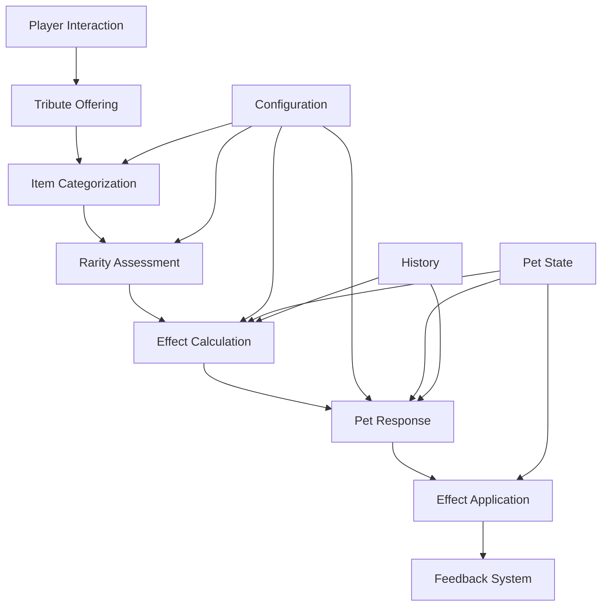

# Tribute Boost System Design Summary

## Overview

This document provides a comprehensive summary of the new tribute boost system design for PetsPlus. The system transforms the current gate-based tribute progression into a flexible, boost-based enhancement framework that rewards player investment without halting progress.

## Design Philosophy Alignment

The new tribute system fully embraces the core PetsPlus design principles:

1. **Amplification Over Gates** - Progression enhances abilities rather than halting them
2. **Integration Without Separation** - Uses vanilla items/mechanics without disruption
3. **Emergent, Not Scripted** - Creates natural moments rather than scripted milestones
4. **Flexible Foundation** - Configurable through JSON
5. **Depth You Choose** - Functional at surface level but with optional complexity
6. **Moments Over Mechanics** - Creates opportunities, not scripts

## System Architecture



## Key Components

### 1. Core Framework
- **TributeBoostManager**: Central coordinator for the tribute system
- **TributeData**: Immutable data structure representing a tribute
- **TributeEffect**: Represents a specific boost effect
- **TributeRegistry**: Manages active tribute boosts for pets

### 2. Categorization System
- **Material Category**: Raw and refined resources (health, defense, attack boosts)
- **Food Category**: Edible items and treats (mood, bond, temporary buffs)
- **Magical Category**: Mystical items (ability enhancements, special powers)
- **Special Category**: Unique items (unique boosts, cross-mod integration)

### 3. Rarity System
- **Common** (0.5x multiplier): Everyday items with modest benefits
- **Uncommon** (1.0x multiplier): Refined items with standard benefits
- **Rare** (2.0x multiplier): Precious items with significant benefits
- **Epic** (3.0x multiplier): Exceptional items with major benefits
- **Legendary** (5.0x multiplier): Unique artifacts with extraordinary benefits

### 4. Effect System
- **Attribute Effects**: Health, defense, attack, speed boosts
- **Mood Effects**: Emotion baselines, mood resilience, emotional capacity
- **Bond Effects**: Bond strength, bond resilience, owner affinity
- **Ability Effects**: Cooldown reduction, potency increase, duration extension
- **Special Effects**: Environmental adaptation, combat specialization, sensory enhancement

### 5. Interaction Mechanics
- **Primary Method**: Sneak + right-click on pet
- **Validation**: Ownership, item, and context validation
- **Response System**: Positive, neutral, and negative pet responses
- **Behavior Modifications**: AI changes based on tribute effects

### 6. Integration Points
- **PetComponent**: New tribute module for tracking active boosts
- **PetAttributeManager**: Integration with existing attribute system
- **Mood System**: Integration with existing emotion mechanics
- **Ability System**: Integration with existing cooldown and potency systems
- **History System**: Integration with existing pet biography mechanics

### 7. Configuration System
- **Core Configuration**: Basic settings and feature toggles
- **Category Configuration**: Category definitions and auto-detection rules
- **Rarity Configuration**: Rarity tiers and automatic mapping
- **Effect Configuration**: Effect definitions and parameters
- **Item Overrides**: Custom item definitions and mod integration
- **Role Configuration**: Role-specific affinities and preferences

### 8. Feedback System
- **Visual Effects**: Category and rarity-specific particle effects
- **Audio Effects**: Response sounds with pitch variations
- **UI Effects**: Action bar messages, toast notifications, status indicators
- **Behavior Effects**: Pet behaviors and AI modifications

### 9. Migration System
- **Automatic Migration**: Seamless conversion from legacy system
- **Data Transformation**: Legacy milestone to tribute boost conversion
- **Validation System**: Integrity and compatibility validation
- **Rollback Capability**: Ability to revert if issues arise

## Player Experience

### Interaction Flow
1. Player sneaks and right-clicks pet with any item
2. System validates interaction and categorizes item
3. Pet responds based on item category, rarity, and preferences
4. Effects are applied permanently until pet death
5. Visual, audio, and UI feedback provide clear indication of results

### Strategic Depth
- **Category Specialization**: Focus on specific tribute categories for role enhancement
- **Rarity Optimization**: Balance common tributes for steady improvement with rare tributes for significant boosts
- **Synergy Combinations**: Combine different tribute types for enhanced effects
- **Pattern Recognition**: Discover optimal tribute patterns for specific pets

### Emergent Storytelling
- **Tribute History**: Pet biography built through tribute patterns
- **Preference Development**: Pets develop preferences based on tribute history
- **Memory System**: Pets remember significant tributes and respond accordingly
- **Milestone Recognition**: Special tributes mark memorable moments

## Technical Implementation

### Performance Considerations
- **Particle Management**: Optimized particle rendering with queuing system
- **Audio Optimization**: Cooldown system to prevent audio spam
- **Effect Caching**: Cached calculations for frequently accessed tribute data
- **Batch Processing**: Efficient handling of multiple tribute effects

### Mod Compatibility
- **Automatic Categorization**: Dynamic detection of modded items
- **Configuration Overrides**: Custom definitions for special mod items
- **Namespace Support**: Proper handling of modded item namespaces
- **Fallback Systems**: Graceful handling of unknown items

### Accessibility Features
- **Visual Enhancements**: High-contrast particles and larger indicators
- **Audio Enhancements**: Louder sounds and different frequency options
- **UI Customization**: Adjustable text sizes and contrast settings
- **Alternative Interactions**: Multiple input methods for different accessibility needs

## Balance Considerations

### Power Scaling
- **Diminishing Returns**: Prevents exploitation of repeated tribute types
- **Effect Caps**: Maximum limits for each effect type
- **Role Affinity**: Balanced bonuses for different pet roles
- **Synergy Limits**: Reasonable caps on combination bonuses

### Progression Integration
- **Complementary Enhancement**: Tribute effects work with existing progression
- **Alternative Paths**: Multiple valid strategies for pet development
- **Player Choice**: Meaningful decisions without forced optimization
- **Accessibility**: Functional at all levels of player engagement

## Configuration Examples

### Basic Tribute Configuration
```json
{
  "tribute_categories": {
    "material": {
      "base_multiplier": 1.0,
      "primary_effects": ["health_boost", "defense_boost", "attack_boost"],
      "auto_detect": {
        "tags": ["minecraft:blocks", "minecraft:ores"],
        "name_patterns": ["ingot", "nugget", "gem", "ore"]
      }
    }
  }
}
```

### Item Override Example
```json
{
  "item_overrides": {
    "minecraft:diamond": {
      "category": "material",
      "rarity": "rare",
      "custom_effects": ["health_boost", "bond_strength"],
      "flavor_text": "A symbol of enduring strength and loyalty"
    }
  }
}
```

## Migration Path

### Phase 1: Preparation (Development)
- Legacy system analysis
- Migration infrastructure development
- Data transformation engine creation

### Phase 2: Implementation (Development)
- Automatic migration system
- Migration validation system
- Rollback capability implementation

### Phase 3: Deployment (Release)
- Automatic migration on first load
- Player notification system
- Monitoring and issue detection

### Phase 4: Stabilization (Post-Release)
- Performance monitoring
- Issue resolution
- Feature refinement based on feedback

## Benefits of New System

### For Players
- **Greater Flexibility**: Any item can be offered as tribute
- **More Choice**: Multiple valid strategies for pet development
- **Enhanced Connection**: More meaningful interactions with pets
- **Better Feedback**: Clear indication of tribute results
- **Preserved Progress**: Seamless migration from current system

### For Server Administrators
- **Configurable Options**: Extensive customization through JSON
- **Mod Compatibility**: Automatic support for modded items
- **Performance Optimization**: Efficient resource usage
- **Accessibility Features**: Options for players with different needs
- **Migration Tools**: Automatic conversion from legacy system

### For the Ecosystem
- **Enhanced Modding**: Rich API for tribute-related content
- **Deeper Integration**: Better compatibility with other systems
- **Future-Proof Design**: Flexible foundation for future enhancements
- **Community Engagement**: More opportunities for player expression

## Conclusion

The new tribute boost system represents a significant enhancement to the PetsPlus experience while maintaining the core design philosophy that makes the mod special. By transforming tributes from gate-based progression blockers into flexible, meaningful enhancement opportunities, the system creates deeper emotional connections between players and their pets.

The design provides both surface-level simplicity and optional depth, ensuring that all players can enjoy the system regardless of their playstyle. The comprehensive configuration system allows server administrators to customize the experience to their specific needs, while the robust migration system ensures that existing players can transition seamlessly to the new system.

The tribute boost system creates opportunities for emergent storytelling, strategic thinking, and personal expression, strengthening the emotional connection that defines the PetsPlus experience while maintaining a natural, intuitive interaction model that feels like a natural extension of Minecraft gameplay.